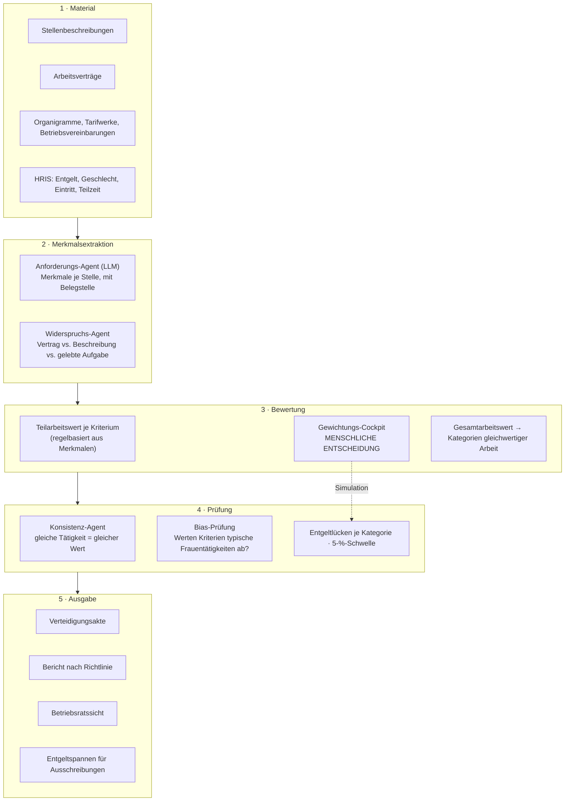

# Entgelttransparenz — Segmentvergleich, SWOT und Agenten-Architektur

*Strategiepapier, Stand August 2026. Quellen am Ende. Als „Größenordnung" markierte Werte sind vor einer Investitionsentscheidung zu verifizieren.*

---

## 1. Die Zange: warum das Zeitfenster jetzt ist

Die EU-Entgelttransparenzrichtlinie (EU) 2023/970 war bis zum **7. Juni 2026** in nationales Recht umzusetzen. **Deutschland hat diese Frist gerissen.** Die Kabinettsberatung wurde von Juni auf August 2026 verschoben, das Umsetzungsgesetz soll nach Angaben aus dem Bundesfamilienministerium **Anfang 2027 in Kraft treten** — begründet unter anderem mit der wirtschaftlichen Lage und den Belastungen für die Wirtschaft.

Entscheidend ist, was das für Arbeitgeber bedeutet: Seit dem 8. Juni 2026 wirken zwei Hebel bereits ohne nationales Gesetz — das unmittelbar geltende **Art. 157 AEUV** zum gleichen Entgelt und die Pflicht der Gerichte zur **richtlinienkonformen Auslegung** bestehender Normen.

**Und dann kommt die Zange.** Die Berichtsfristen der Richtlinie verschieben sich durch die deutsche Verzögerung nicht:

| Betriebsgröße | Erstbericht | Turnus |
|---|---|---|
| ab 250 Beschäftigte | 7. Juni 2027 | jährlich |
| 150–249 Beschäftigte | 7. Juni 2027 | alle drei Jahre |
| 100–149 Beschäftigte | 2031 | alle drei Jahre |

> Ein deutsches Gesetz Anfang 2027 und der erste Bericht am 7. Juni 2027 — **das sind wenige Monate zwischen Rechtsklarheit und Abgabetermin.** Wer erst auf das Gesetz wartet, hat keine Zeit mehr, die Vorarbeit zu leisten. Und die Vorarbeit ist der eigentliche Aufwand.

Das ist exakt das Muster, das die E-Rechnungspflicht im Buchhaltungsdossier so wertvoll gemacht hat: ein bekannter, harter Stichtag, der noch vor uns liegt, mit einem Markt, der ihn noch nicht bearbeitet hat.

### Was die Richtlinie tatsächlich verlangt

Über die Berichtspflicht hinaus — und das ist der arbeitsintensive Teil:

- **Objektive, geschlechtsneutrale Entgelt- und Stellenbewertungssysteme** müssen vorgehalten werden. Nicht optional, nicht ab einer Größe.
- Bei einem Entgeltunterschied von **über 5 % je Kategorie gleichwertiger Arbeit**, der sachlich nicht gerechtfertigt und nicht binnen sechs Monaten beseitigt wird, ist eine **gemeinsame Entgeltbewertung mit der Arbeitnehmervertretung** zwingend.
- **Entgeltspanne in der Stellenausschreibung** oder vor dem Bewerbungsgespräch; **Verbot der Frage nach dem bisherigen Gehalt**.
- **Auskunftsanspruch** der Beschäftigten über das eigene Entgelt und die Durchschnittsentgelte vergleichbarer Gruppen.
- **Beweislastumkehr** zugunsten der Beschäftigten und Schadensersatzansprüche.

---

## 2. Der Markt ist nicht leer — und das ist der wichtigste Befund

Anders als beim Buchhaltungsdossier steht hier bereits ein besetztes Feld. Die Fachpresse führt schon Marktüberblicke:

| Anbieter | Herkunft | Schwerpunkt |
|---|---|---|
| **Kienbaum Pay Equity Tool** | DE | Gap-Analyse und Berichterstattung, aus jahrzehntelanger Vergütungsberatung; von Arbeitgeberverbänden (bayme vbm) mit eigenem Merkblatt begleitet |
| Mercer, WTW | international | Beratungsprojekte mit Werkzeugunterstützung |
| Figures | FR | Vergütungsbenchmarking, HRIS-Integrationen, Mercer-Partnerschaft |
| Ravio | UK | Echtzeit-Gehaltsbenchmarking |
| Competo, Ines Analytics | DE | Pay-Equity-Analyse |
| Evenpay (FI), Pay Gap (DK), Skills Trust (IE), Orbiq | EU | Pay-Equity-Analyse und EU-Compliance |

**Die Verbandsempfehlung für Kienbaum ist die ernsteste Nachricht dieser Tabelle.** Wenn ein Arbeitgeberverband ein Werkzeug mit einem eigenen Anwendungs-Merkblatt begleitet, ist der billigste Vertriebskanal in den Mittelstand bereits belegt.

### Wo trotzdem eine Lücke ist

Fast alle genannten Werkzeuge lösen dieselbe Hälfte des Problems: Sie **rechnen** Entgeltlücken — auf Basis von Vergleichsgruppen, die das Unternehmen liefern muss. Sie setzen also voraus, dass eine belastbare Job-Architektur existiert.

Genau die existiert im Mittelstand nicht. Ein Unternehmen mit 180 Beschäftigten hat gewachsene Stellenbezeichnungen, keine Systematik. Und die Richtlinie verlangt nicht Vergleichsgruppen nach Bauchgefühl, sondern **Kategorien gleichwertiger Arbeit nach objektiven, geschlechtsneutralen Kriterien**.

> **Der teuerste, rechtlich tragende und bislang unbesetzte Schritt ist die Arbeitsbewertung selbst.** Er ist zugleich der einzige Schritt der ganzen Kette, der wirklich KI-förmig ist: Aus Stellenbeschreibungen, Arbeitsverträgen, Tarifwerken, Organigrammen und der gelebten Aufgabenverteilung muss eine konsistente, begründete Bewertung entstehen. Das ist Urteilsarbeit an unstrukturiertem Text — und heute ein Beratungsprojekt zu Tagessätzen, das sich ein Betrieb mit 180 Beschäftigten nicht leistet.

### Der methodische Hintergrund

Die anerkannte Methode ist die **analytische Arbeitsbewertung**: Ausgewählte Anforderungsmerkmale werden für jede Stelle einzeln bewertet, je Kriterium ergibt sich ein Teilarbeitswert, aus Gewichtung und Addition ein Gesamtarbeitswert. Gleichwertig sind Tätigkeiten, die nach objektiven, geschlechtsneutralen Kriterien einen gleichen oder ähnlichen Arbeitswert haben. Die etablierten Instrumente sind **eg-check.de** (das ausdrücklich auch die Arbeitsbewertung selbst prüft) und **Logib** beziehungsweise Logib-D.

Ein Detail aus der Forschung, das produktentscheidend ist: An Logib-D wird kritisiert, dass es mit Variablen arbeitet, die selbst diskriminierungsbehaftet sein können, und dass der Grundsatz „gleicher Lohn für gleichwertige Arbeit" gerade nicht in den Blick gerät. Und weiter: **Die Gewichtung der Merkmale ist eine (lohn-)politische Entscheidung**, denn sie bestimmt die Hierarchie der Arbeitsplätze und damit der Einkommen.

Das hat eine harte Konsequenz für die Architektur, siehe Abschnitt 5: **Die Gewichtung darf niemals das Modell festlegen.**

---

## 3. Bewertungsraster

Bewertet werden Abschnitte der Wertschöpfungskette, nicht Branchen. Skala 1–5.

| # | Kriterium | Gewicht |
|---|---|---|
| K1 | Marktgröße im adressierbaren Segment | 1,0 |
| K2 | Zahlungsbereitschaft | 1,5 |
| K3 | Regulatorischer Zwang mit Datum | 1,5 |
| K4 | **KI-Hebel** | 2,0 |
| K5 | Wettbewerbslücke | 2,0 |
| K6 | **Wiederkehrender Umsatz** | 1,5 |
| K7 | Rechtliche Angreifbarkeit (invers: 5 = unkritisch) | 1,0 |
| K8 | Verkaufbarkeit / Kanalzugang | 1,0 |

K6 hat hier ein höheres Gewicht als im Buchhaltungsdossier — aus einem konkreten Grund, siehe Abschnitt 4.

---

## 4. Segmentvergleich

| Abschnitt der Kette | K1 | K2 | K3 | K4 | K5 | K6 | K7 | K8 | **Score** (max 58) |
|---|:--:|:--:|:--:|:--:|:--:|:--:|:--:|:--:|:--:|
| **S2 Arbeitsbewertung & Job-Architektur** | 4 | 5 | 5 | 5 | 5 | 2 | 3 | 3 | **46,5** |
| **S4 Recruiting- & Ausschreibungs-Compliance** | 5 | 3 | 4 | 3 | 4 | 5 | 4 | 4 | **42,0** |
| **S6 Gemeinsame Entgeltbewertung mit Betriebsrat** | 2 | 4 | 5 | 4 | 5 | 2 | 2 | 2 | **38,0** |
| S5 Auskunftsansprüche bearbeiten | 4 | 2 | 4 | 3 | 4 | 5 | 3 | 3 | 37,0 |
| S3 Gap-Analyse & Berichtserstellung | 4 | 4 | 5 | 2 | 1 | 3 | 4 | 3 | 32,0 |
| S7 Remediation- und Budgetplanung | 3 | 4 | 3 | 3 | 3 | 3 | 3 | 3 | 33,0 |
| S1 Gehaltsbenchmarking | 5 | 4 | 2 | 1 | 1 | 5 | 5 | 4 | 30,0 |

**Marktgröße, Größenordnung:** In Deutschland gab es 2024 rund 3,5 Millionen rechtliche Einheiten; Einheiten mit mehr als 250 Beschäftigten machen davon 0,5 % aus, und 12.241 Kapitalgesellschaften hatten im Jahresdurchschnitt 250 oder mehr abhängig Beschäftigte. Die Gruppe 100–249 Beschäftigte liegt schätzungsweise bei 30.000–35.000 Unternehmen — **diese Zahl ist zu verifizieren** und der wackeligste Punkt der Marktrechnung.

### Warum die anderen zurückfallen

**S1 Gehaltsbenchmarking — nicht machen.** Der Datenbestand ist der Burggraben, und Figures, Ravio und Mercer haben ihn. KI-Hebel praktisch null: Das ist ein Datensammel- und Statistikgeschäft.

**S3 Gap-Analyse und Berichte — der offensichtliche Einstieg, deshalb besetzt.** Kienbaum, Competo, Ines Analytics und die EU-Anbieter sitzen genau hier, und die Rechnung selbst ist trivial, sobald die Gruppen stehen. Wer hier einsteigt, verkauft ein Feature.

**S5 Auskunftsansprüche — richtige Wiederkehr, zu geringer Schmerz.** Angenehm laufendes Geschäft, aber die Zahlungsbereitschaft für „wir beantworten Mitarbeiteranfragen" ist begrenzt. Gute Ergänzung, kein Einstieg.

**S6 Gemeinsame Entgeltbewertung — fachlich der spannendste Teil, vertrieblich der schwerste.** Sie tritt erst ein, wenn es bereits brennt, sie erfordert Mitwirkung der Arbeitnehmervertretung, und sie ist ein einmaliges Ereignis. Als Modul innerhalb eines größeren Produkts sinnvoll, als Startpunkt nicht.

---

## 5. Deep Dive

### 5.1 S2 — Arbeitsbewertung & Job-Architektur *(Arbeitstitel: „Gleichwert")*

**Produktdefinition.** Ein Agentensystem, das aus dem vorhandenen Material eines Mittelständlers eine **prüffähige analytische Arbeitsbewertung** erzeugt:

- Es liest **Stellenbeschreibungen, Arbeitsverträge, Stellenausschreibungen, Organigramme, Tarifwerke und Betriebsvereinbarungen** — also genau das heterogene, teils widersprüchliche Material, das jedes Unternehmen hat und niemand systematisiert.
- Es bewertet jede Stelle entlang der vier Merkmalsgruppen der Richtlinie: **Kenntnisse und Fähigkeiten, Belastungen, Verantwortung, Arbeitsbedingungen** — mit Teilarbeitswerten je Kriterium.
- **Jede Bewertung ist an eine Belegstelle gebunden.** Nicht „Verantwortung: 4", sondern „Verantwortung: 4, weil im Arbeitsvertrag Ziffer 3 Budgetverantwortung bis 50.000 € und Fachaufsicht für drei Personen vereinbart ist".
- Es prüft **Konsistenz**: gleiche Tätigkeit muss gleichen Wert bekommen, unabhängig davon, ob die Stelle „Sachbearbeiterin" oder „Junior Manager" heißt. Genau hier entstehen die Lücken, die die Richtlinie meint.
- Es bildet daraus **Kategorien gleichwertiger Arbeit**, rechnet die Entgeltlücken je Kategorie und markiert die 5-%-Überschreitungen.
- Es erzeugt eine **Bewertungsdokumentation**, die einem Betriebsrat und einem Arbeitsgericht standhält.

**Das unkopierbare Feature: die Verteidigungsakte.**
Wegen der **Beweislastumkehr** muss im Streitfall der Arbeitgeber zeigen, dass die Entgeltdifferenz sachlich gerechtfertigt ist. Das Produkt erzeugt daher zu jeder Kategorie und jeder Einzelbewertung eine geschlossene Beweiskette: welche Kriterien, welche Gewichtung, wer hat sie wann beschlossen, welche Belegstelle stützt welchen Teilarbeitswert, welche Konsistenzprüfungen liefen, was wurde bei welchem Widerspruch entschieden. Das ist kein Reporting — das ist das Aktenstück, mit dem die Personalleitung in den Gerichtstermin geht. **Dafür wird bezahlt, nicht für eine Prozentzahl.**

#### SWOT — „Gleichwert"

**Stärken**
- **Der einzige Kettenabschnitt mit echtem KI-Hebel.** Alles andere ist Statistik auf gepflegten Daten. Die Bewertung ist Urteilsarbeit an unstrukturiertem Text — genau die Aufgabe, bei der Sprachmodelle einen realen Vorsprung gegenüber Tabellen haben.
- **Harter Stichtag ohne Verhandlungsspielraum:** 7. Juni 2027 für alle ab 150 Beschäftigten.
- **Der Wettbewerb setzt voraus, was du herstellst.** Kienbaum, Figures und Ravio beginnen dort, wo dein Produkt aufhört. Das macht dich potenziell zum Vorprodukt der gesamten Kategorie statt zum Konkurrenten — mit der Option auf Partnerschaften statt Preiskampf.
- **Hohe Zahlungsbereitschaft**, weil die Alternative ein Beratungsprojekt zu Tagessätzen ist. Der Vergleichspreis ist Kienbaum, nicht eine HR-Software.
- **Der Nutzen überlebt die Regulierung.** Eine saubere Job-Architektur ist die Grundlage für Vergütungsbänder, Laufbahnmodelle und Recruiting — auch wenn das Gesetz milder ausfällt als erwartet.

**Schwächen**
- **Das Retentionsproblem ist gravierend und muss vor der ersten Zeile Code gelöst sein.** Eine Arbeitsbewertung ist ein Projekt, kein Abo. Für 150–249 Beschäftigte ist der Bericht nur alle drei Jahre fällig. Ein Werkzeug, das einmal benutzt und dann vergessen wird, hat keine Bewertung. **Die Antwort muss im Produkt stecken:** Jede Neueinstellung, jede Umstrukturierung und jede Stellenausschreibung muss durch die Architektur laufen — dann ist es ein lebendes System und kein Projektartefakt. Genau deshalb steht S4 in Abschnitt 4 auf Platz zwei: als notwendige zweite Hälfte, nicht als Alternative.
- **Fachlich anspruchsvoll und angreifbar.** Arbeitsbewertung ist ein etabliertes Feld mit Methodenstreit. Ein Betriebsrat mit gewerkschaftlicher Beratung wird deine Kriterien und vor allem deine Gewichtung hinterfragen — zu Recht.
- **Der billigste Kanal ist besetzt.** Kienbaum hat eine Verbandsbegleitung; du müsstest dir den Zugang zum Mittelstand teurer kaufen.
- **Kaltstart ohne Referenzen.** Niemand macht seine erste Entgeltgleichheitsprüfung mit einem unbekannten Anbieter. Die ersten fünf Kunden brauchen einen Namen daneben — Kanzlei, Beratung oder Verband.

**Chancen**
- **Der Verzug der deutschen Umsetzung ist dein Vertriebsargument.** Solange Unternehmen auf das Gesetz warten, verlieren sie die Vorlaufzeit, die sie für die Arbeitsbewertung brauchen. Genau diese Vorlaufzeit verkaufst du.
- **Arbeitsrechtskanzleien als Kanal.** Sie beraten zur Richtlinie, wollen aber die Datenarbeit nicht leisten. Dasselbe Muster wie bei Steuerkanzleien: eine Kanzlei bringt zwanzig Mandanten.
- **Öffentliche Arbeitgeber** sind bereits vorbereitungspflichtig, haben Tarifstrukturen als Datenbasis und beschaffen planbar.
- **EU-Skalierung ohne Neupositionierung.** Die Richtlinie gilt in allen Mitgliedstaaten, die Frist überall. Anders als beim Steuerrecht ist die Fachlogik hier grenzüberschreitend weitgehend identisch — das ist selten und wertvoll.
- **Die Marktkonsolidierung kommt.** Bei acht bis zehn Anbietern in einem regulierungsgetriebenen Markt wird zugekauft. Wer das Vorprodukt besitzt, das alle brauchen, ist ein naheliegendes Ziel.

**Risiken**
- **Politisches Risiko, und es ist real.** Die Verzögerung wird ausdrücklich mit Belastungen für die Wirtschaft begründet. Eine deutliche Entschärfung — höhere Schwellenwerte, längere Fristen, abgeschwächte Bewertungspflicht — würde die Dringlichkeit beschädigen. **Das ist das gravierendste Einzelrisiko dieses Feldes** und der Grund, die Positionierung nicht ausschließlich auf Compliance zu bauen, sondern auf die Job-Architektur als betriebswirtschaftlichen Wert.
- **Mitbestimmung.** Entlohnungsgrundsätze und Bewertungssysteme berühren die Mitbestimmung des Betriebsrats. Ein Produkt, das ausschließlich als Arbeitgeberwerkzeug auftritt, wird in mitbestimmten Betrieben blockiert. Die Betriebsratssicht gehört ins Produkt, nicht ins Vertriebsgespräch.
- **RDG-Grenze.** Die rechtliche Bewertung, ob eine Entgeltdifferenz sachlich gerechtfertigt ist, ist Rechtsdienstleistung. Dasselbe Muster wie § 5 StBerG im Buchhaltungsdossier: Du darfst Sachverhalte strukturieren, aufbereiten und dokumentieren — die Würdigung gehört zum Anwalt. Das gehört in die Produktarchitektur und in die AGB, nicht in eine Fußnote.
- **Diskriminierung durch das Werkzeug selbst.** Wenn deine Kriterien oder Gewichtungen typische Frauentätigkeiten systematisch abwerten — der Vorwurf, der Logib-D trifft —, produzierst du das Problem, das du lösen sollst, und zwar dokumentiert. Das ist zugleich der größte Reputationsschaden, der in diesem Feld möglich ist.

---

### 5.2 S4 — Recruiting- & Ausschreibungs-Compliance *(die zweite Hälfte, nicht die Alternative)*

Die Richtlinie verlangt die Angabe der Entgeltspanne in der Ausschreibung oder vor dem Bewerbungsgespräch und verbietet die Frage nach dem bisherigen Gehalt. Das betrifft **jede offene Stelle in jedem Unternehmen, laufend** — der einzige Teil der Kette mit natürlicher Wiederkehr (K6 = 5) und dem größten adressierbaren Kreis (K1 = 5).

Als eigenständiges Produkt ist es zu dünn: Eine Gehaltsspanne in eine Stellenanzeige zu schreiben, ist kein Unternehmen. **In Kombination mit S2 ist es die Lösung des Retentionsproblems:** Die Ausschreibung zieht die Spanne aus der Job-Architektur, jede neue Stelle wird beim Anlegen eingewertet, jede Umstrukturierung aktualisiert das Modell. Aus dem Projektartefakt wird ein System, das jede Woche benutzt wird — und damit ein Abo, das man nicht kündigt, ohne die Compliance zu verlieren.

**Empfehlung: S2 als Einstieg und Preisanker, S4 als Bindung.** Getrennt sind beide schwach.

---

## 6. Architektur

### 6.1 Das Grundprinzip

Analog zum Buchhaltungsdossier, aber mit einer schärferen Trennlinie:

> **Das Modell stellt Anforderungsmerkmale fest und belegt sie. Die Gewichtung dieser Merkmale ist eine dokumentierte Entscheidung des Unternehmens — niemals eine Modellausgabe.**

Der Grund ist nicht technische Vorsicht, sondern die Sache selbst: Die Gewichtung bestimmt die Hierarchie der Arbeitsplätze und damit der Einkommen. Sie ist eine unternehmens- und lohnpolitische Entscheidung, in mitbestimmten Betrieben eine mitbestimmungspflichtige. Ein Modell, das sie stillschweigend trifft, ist rechtlich wertlos und politisch angreifbar. Das Produkt muss die Gewichtung deshalb **sichtbar, verhandelbar und protokolliert** machen — inklusive der Simulation, wie sich eine andere Gewichtung auf die Kategorien und die Lücken auswirkt.

### 6.2 Schichten und Agenten

| # | Agent | Aufgabe | LLM-Anteil |
|---|---|---|---|
| 1 | **Materialaufnahme** | Dokumente und HRIS-Export einlesen, Personenbezug minimieren | keiner |
| 2 | **Anforderungsextraktion** | Merkmale je Stelle entlang der vier Gruppen, jeweils mit wörtlicher Belegstelle und Konfidenz | hoch |
| 3 | **Widerspruch** | Vertrag, Stellenbeschreibung und gelebte Aufgabe weichen fast immer ab — Konflikte sichtbar machen statt glätten | hoch |
| 4 | **Teilarbeitswert** | Merkmale → Punktwerte je Kriterium, regelbasiert und nachvollziehbar | keiner |
| 5 | **Gewichtung** | Cockpit für die Unternehmensentscheidung, mit Simulation der Auswirkungen | keiner |
| 6 | **Kategorienbildung** | Gesamtarbeitswerte → Kategorien gleichwertiger Arbeit, mit Bandbreitenlogik | keiner |
| 7 | **Konsistenz** | Gleiche Tätigkeit, gleicher Wert — quer über Bezeichnungen und Abteilungen | mittel |
| 8 | **Bias-Prüfung** | Prüft die Kriterien und Gewichte selbst auf mittelbare Benachteiligung | mittel |
| 9 | **Lückenrechnung** | Entgeltdifferenzen je Kategorie, 5-%-Schwelle, Zeitreihe | keiner |
| 10 | **Dokumentation** | Verteidigungsakte, Bericht, Betriebsratssicht, Entgeltspannen | mittel |

### 6.3 Vier Mechanismen, die über Erfolg entscheiden

**a) Belegpflicht für jede Bewertung.** Kein Punktwert ohne wörtliche Fundstelle im Quelldokument. Das ist die Grundlage der Verteidigungsakte und gleichzeitig die wirksamste Halluzinationsbremse: Ein Merkmal, das nirgends belegt ist, wird nicht bewertet, sondern zur Klärung vorgelegt.

**b) Widersprüche sichtbar machen, nicht auflösen.** Die Stellenbeschreibung ist von 2019, der Vertrag von 2015, tatsächlich macht die Person seit 2023 etwas anderes. Ein Agent, der das glättet, produziert eine hübsche und falsche Bewertung. Der Widerspruch selbst ist das wertvollste Ergebnis — er zeigt der Personalabteilung, wo sie hinschauen muss.

**c) Die Gewichtung ist ein Bedienelement, keine Ausgabe.** Mit Simulation: Wenn körperliche Belastung höher und formale Qualifikation niedriger gewichtet wird, wie verschieben sich Kategorien und Lücken? Das ist genau das Gespräch, das Arbeitgeber und Betriebsrat führen müssen — und ein Werkzeug, das dieses Gespräch strukturiert, ist in mitbestimmten Betrieben nicht blockierbar, sondern erwünscht.

**d) Versionierung mit Stichtagsbezug.** Bewertungen, Gewichtungen und Kategorien ändern sich. Ein Bericht zum 7. Juni 2027 muss Jahre später exakt reproduzierbar sein, inklusive der damals gültigen Gewichtung und der Person, die sie beschlossen hat. Das gehört ins erste Datenmodell.

### 6.4 Datenschutz

Die Verarbeitung betrifft Entgelt, Geschlecht und Beschäftigungsdaten — in kleinen Kategorien sind Einzelpersonen trivial reidentifizierbar. Daraus folgen Mindestgruppengrößen bei jeder Ausgabe, strikte Rollentrennung zwischen Personalabteilung und Betriebsratssicht, EU-Verarbeitung, und eine Datenschutz-Folgenabschätzung, die du dem Kunden fertig mitlieferst. Letzteres ist wie beim Kanzleiprodukt ein Vertriebsvorteil, kein Aufwand.

---

## 7. Geschäftsmodell und erste zwölf Monate

**Preisanker** ist das Beratungsprojekt, nicht die HR-Software.

| Plan | Preis | Inhalt |
|---|---|---|
| Readiness-Check | kostenlos | 20 Stellen einwerten, Konsistenzbefunde, grobe Lückenschätzung |
| Aufbau der Job-Architektur | 8.000–25.000 € einmalig, nach Stellenanzahl | vollständige Bewertung, Kategorien, Verteidigungsakte, Betriebsratssicht |
| Pflege & Compliance | 400–1.200 €/Monat | Neueinstellungen einwerten, Entgeltspannen für Ausschreibungen, Auskunftsansprüche, jährliche Neuberechnung, Berichtserstellung |

Die Aufteilung ist bewusst: Das Einmalprojekt trägt die Akquisekosten, das Abo trägt das Unternehmen.

**Roadmap.**

- **Monat 0–2:** Methodik festlegen und mit einer Arbeitsrechtskanzlei sowie einer Arbeitsbewertungs-Expertin gegenprüfen. 60 echte Stellenbeschreibungen aus drei Betrieben einwerten und die Ergebnisse gegen eine manuelle Expertenbewertung halten. **Ohne diesen Abgleich existiert kein Produkt** — Übereinstimmung mit dem menschlichen Urteil ist hier das Äquivalent zur Kontierungsgenauigkeit.
- **Monat 3–5:** Zwei Design-Partner mit 150–400 Beschäftigten, davon einer mitbestimmt. Agenten 1–7 und die Verteidigungsakte. Zielmarke: Betriebsrat akzeptiert die Methodik.
- **Monat 6–9:** Bias-Prüfung, Gewichtungssimulation, Berichtsausgabe. Erste zahlende Projekte. Ziel: fünf abgeschlossene Architekturen mit Referenzfreigabe.
- **Monat 10–12:** S4-Modul (Entgeltspannen und Recruiting), Umstellung der Erstkunden auf das Abo, Kanalaufbau über Arbeitsrechtskanzleien. **Bis zum Frühjahr 2027 muss die Vertriebsmaschine stehen** — danach ist der Erstbericht abgegeben und die Dringlichkeit sinkt für drei Jahre.

---

## 8. Die drei größten Risiken

1. **Politisches Risiko.** Wird die deutsche Umsetzung entschärft oder erneut verschoben, verlierst du den Kaufanlass. Gegenmittel: Positionierung auf die Job-Architektur als betriebswirtschaftlichen Wert, nicht ausschließlich auf Compliance — dann überlebt das Produkt eine milde Gesetzeslage.
2. **Das Retentionsproblem.** Einmalprojekt mit Dreijahresturnus ist die schlechteste denkbare Abo-Struktur. Wenn S4 nicht funktioniert, ist das Geschäft ein Beratungsunternehmen mit Softwareunterstützung — auch das kann profitabel sein, aber es ist nicht das Unternehmen, das hier beschrieben wird, und es skaliert anders.
3. **Methodische Angreifbarkeit.** Deine Bewertung muss einen kritischen Betriebsrat, eine Gewerkschaftsberatung und im Zweifel ein Arbeitsgericht überstehen. Ein einziger öffentlich gewordener Fall, in dem dein Werkzeug typische Frauentätigkeiten systematisch abgewertet hat, beendet das Unternehmen. Deshalb steht die Bias-Prüfung als eigener Agent im System und nicht als Absatz im Handbuch.

---

## Quellen

- [Richtlinie (EU) 2023/970 (Entgelttransparenzrichtlinie) — Überblick](https://de.wikipedia.org/wiki/Richtlinie_(EU)_2023/970_(Entgelttransparenzrichtlinie))
- [Personalwirtschaft: Deutschland verpasst Frist, Kabinettsitzung erst im August](https://www.personalwirtschaft.de/news/verguetung/eu-entgelttransparenzrichtlinie-deutschland-verpasst-frist-das-sind-die-konsequenzen-203783/)
- [Noerr: Keine rechtzeitige Umsetzung — was gilt nach dem 7. Juni 2026?](https://www.noerr.com/de/insights/keine-rechtzeitige-umsetzung-der-eu-entgelttransparenzrichtlinie-in-deutsches-recht-was-gilt-nach-dem-7-juni-2026)
- [Grant Thornton: Ist der 7. Juni 2026 ein harter Stichtag?](https://www.grantthornton.de/themen/2026/eu-entgelttransparenzrichtlinie-ist-der-7-juni-2026-ein-harter-stichtag/)
- [Rödl: Neue Pflichten und Handlungsbedarf für öffentliche Arbeitgeber](https://www.roedl.com/insights/eu-entgelttransparenzrichtlinie-2023-970-neue-pflichten-handlungsbedarf-oeffentliche-arbeitgeber/)
- [Deloitte: EU-Entgelttransparenzrichtlinie](https://www.deloitte.com/de/de/services/tax/perspectives/eu-entgelttransparenzrichtlinie.html)
- [IHK Bonn/Rhein-Sieg: Entgelttransparenzrichtlinie](https://www.ihk-bonn.de/recht-und-steuern/recht/entgelttransparenzrichtlinie)
- [Personalwirtschaft: Pay-Equity-Tools im Marktüberblick](https://www.personalwirtschaft.de/news/verguetung/pay-equity-tools-im-marktueberblick-202382/)
- [Kienbaum Pay Equity Tool](https://payequity.kienbaum.com/)
- [bayme vbm: Merkblatt zum Kienbaum Pay Equity Tool](https://www.baymevbm.de/baymevbm/ServiceCenter/Personal/Entgelt-Leistungen/Entgelt/Entgelttransparenz/Merkblatt-Kienbaum-Pay-Equity-Tool.jsp)
- [Mercer: Pay Equity und Entgelttransparenz in der EU](https://www.mercer.com/de-de/insights/talent-and-transformation/diversity-equity-and-inclusion/pay-equity-eu/)
- [Antidiskriminierungsstelle: Gleiche und gleichwertige Arbeit](https://www.antidiskriminierungsstelle.de/SharedDocs/Glossar_Entgeltgleichheit/DE/15_Gleiche_gleichwertige_Arbeit.html)
- [Hans-Böckler-Stiftung: Ein Check zur Entgeltgleichheit im Betrieb (eg-check)](https://boeckler.de/22497_22502.htm)
- [Hans-Böckler-Stiftung: Lohnungleichheit im Test (Kritik an Logib-D)](https://www.boeckler.de/de/magazin-mitbestimmung-2744-lohnungleichheit-im-test-10776.htm)
- [Wikipedia: Arbeitsbewertung (analytische Verfahren, Gewichtung)](https://de.wikipedia.org/wiki/Arbeitsbewertung)
- [Infoportal Lohntransparenz: Was bedeutet „gleichwertige Arbeit"?](https://lohntransparenz.eu/index.php/2025/09/19/entgelttransparenzrichtlinie-was-bedeutet-gleichwertige-arbeit/)
- [Statistisches Bundesamt: 3,5 Millionen Rechtliche Einheiten im Berichtsjahr 2024](https://www.destatis.de/DE/Themen/Branchen-Unternehmen/Unternehmen/Unternehmensregister/_aktuell-unternehmenregister.html)
