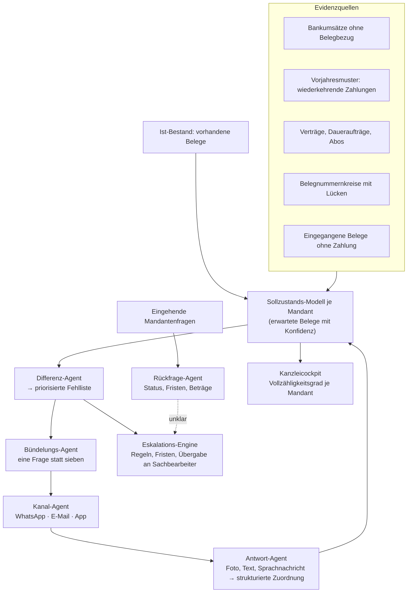

# Werkzeuge für Steuerkanzleien — Workflow-Vergleich, SWOT und Agenten-Architektur

*Strategiepapier, Stand August 2026. Quellen am Ende. Als „Größenordnung" markierte Werte sind vor einer Investitionsentscheidung zu verifizieren.*

---

## 1. Warum die Kanzlei der bessere Kunde ist als ihr Mandant

Das vorangegangene Dossier zur KI-Buchhaltung endete an einer Wand: § 6 StBerG deckt das Kontieren von Belegen nicht als mechanische Tätigkeit, die Umsatzsteuer-Voranmeldung ist Vorbehaltsaufgabe, und der Jahresabschluss erst recht. Jedes Produkt für Kleinbetriebe braucht deshalb eine Kanzlei in der Verantwortung.

**Wenn die Kanzlei ohnehin im Konstrukt sein muss, ist sie der ehrlichere Kunde.** Der Nutzer ist selbst Berufsträger, das Berufsrecht ist damit kein Konstruktionsproblem mehr, sondern nur noch eine Auftragsverarbeitungsfrage. Und der Schmerz ist größer.

### Die Marktzahlen

| Größe | Wert |
|---|---|
| Kammermitglieder (Stand 1.1.2026) | 105.953 |
| davon Steuerberaterinnen und Steuerberater | 89.549 |
| Steuerberatungsgesellschaften nach § 49 StBerG | ca. 13.500 |
| Beschäftigte in der Branche insgesamt | über 95.000 |
| Ausbildungsverhältnisse Steuerfachangestellte | 17.081 (−1,3 % zum Vorjahr) |

Die letzte Zeile ist die wichtigste: **Der Nachwuchs schrumpft, während die Arbeit wächst.** Die E-Rechnungspflicht ab 2027/2028 schiebt zusätzliches Volumen in genau diese Kanzleien.

### Die entscheidende Beobachtung

72,7 % der Kanzleien berichten Schwierigkeiten, qualifiziertes Personal zu finden — der höchste Wert aller Branchen in Deutschland, über 10.000 unbesetzte Stellen. Aber die verwertbare Nuance ist eine andere:

> **Kanzleien lehnen seit zwei Jahren Mandate ab, die sie gerne genommen hätten.** Es ist Umsatz, den sie sich leisten könnten, wenn sie nur die Leute dafür hätten.

Das verändert die Preislogik vollständig. Du verkaufst keine Kosteneinsparung — dieses Gespräch endet immer bei „was kostet es und was spare ich". Du verkaufst **Kapazität**, also die Fähigkeit, ein zusätzliches Mandat anzunehmen. Ein Mandat mit 400 €/Monat Honorar rechtfertigt ein Werkzeug, das 60 € kostet, sofort und ohne Rechenübung.

Die zweite verwertbare Zahl: **71 % der Kanzleien halten KI für strategisch relevant, aber nur 18 % setzen sie ein.** Das ist die klassische Frühmarktlücke — Problembewusstsein vorhanden, Lösung noch nicht gewählt.

---

## 2. Was bereits besetzt ist

Bevor irgendein Workflow bewertet wird, gehört die Wettbewerbskarte auf den Tisch. Sie ist der Grund, warum die naheliegende Idee — „KI, die Belege bucht" — nicht mehr die richtige ist.

| Bereich | Wer sitzt dort | Bewertung |
|---|---|---|
| **Belegverarbeitung und Kontierung** | Finmatics (LLM-basiert, DATEV-zertifizierte Schnittstellen, Mehrmandantenarchitektur), Supercount AI, Candis, Bimetrics | **Voll besetzt.** Finmatics hat die DATEV-Integration, die den Zugang praktisch definiert. |
| **Fachrecherche und Textgenerierung** | Taxy.io — inzwischen Teil der Buy-and-Build-Strategie von Visma im DACH-Raum | **Besetzt und konsolidiert.** Ein Konzern im Rücken. |
| **Bescheidprüfung** | Kanzleisoftware selbst (Agenda, DATEV) mit automatischer Abweichungskennzeichnung und Fristermittlung; Deloitte TAV im Enterprise-Segment | **Besetzt**, teils als Standardfunktion der Kanzleisoftware. |
| **Kanzleisoftware als Plattform** | DATEV, Agenda, Wolters Kluwer, Simba | Nicht angreifbar. Nur als Integration denkbar. |

**Fazit:** Der Belegtrichter ist voll. Wer 2026 als Vierter eine Kontierungs-KI baut, konkurriert gegen ein Produkt mit DATEV-Zertifizierung und mehrjährigem Trainingsvorsprung. Die Lücke liegt woanders — und die Recherche zeigt ziemlich genau, wo.

---

## 3. Bewertungsraster

Bewertet werden nicht Branchen, sondern **Arbeitsschritte innerhalb der Kanzlei**. Skala 1–5.

| # | Kriterium | Gewicht | Begründung |
|---|---|---|---|
| K1 | Zeitanteil am Kanzleialltag | 1,5 | Wie viel Kapazität hängt tatsächlich daran? |
| K2 | **KI-Hebel** | 2,0 | Wie viel davon kann ein Agent wirklich übernehmen? |
| K3 | Wettbewerbslücke | 2,0 | Nach Abschnitt 2 das schärfste Ausschlusskriterium. |
| K4 | Datenzugang ohne DATEV-Kooperation | 1,5 | Wer die Kanzleisoftware braucht, verhandelt aus der Schwäche. |
| K5 | Haftungsnähe (invers: 5 = geringe Haftung) | 1,5 | Nähe zur Vorbehaltsaufgabe erhöht Freigabeaufwand und Risiko. |
| K6 | Verkaufbarkeit an den Partner | 1,0 | Wer entscheidet, und versteht er den Nutzen in zwei Sätzen? |
| K7 | Wiederkehrender Charakter | 1,0 | Einmalprojekte tragen kein Abo. |
| K8 | Integrationslast | 1,0 | Wie viel Schnittstellenpflege frisst das Team dauerhaft? |

---

## 4. Workflow-Vergleich

| Workflow | K1 Zeit | K2 KI | K3 Lücke | K4 Daten | K5 Haftung | K6 Verkauf | K7 Wiederkehr | K8 Integration | **Score** (max 55) |
|---|:--:|:--:|:--:|:--:|:--:|:--:|:--:|:--:|:--:|
| **W2 Belegnachlauf & Mandantenkoordination** | 5 | 5 | 5 | 5 | 5 | 4 | 5 | 4 | **50,5** |
| **W3 Lohnbuchhaltung** | 4 | 4 | 4 | 3 | 2 | 5 | 5 | 3 | **40,0** |
| **W4 Jahresabschluss-Erstellung** | 5 | 3 | 4 | 2 | 2 | 4 | 4 | 2 | **36,5** |
| W8 Mandanten-Onboarding & Stammdaten | 2 | 4 | 4 | 4 | 4 | 3 | 2 | 4 | 35,0 |
| W7 Betriebsprüfungsbegleitung | 2 | 4 | 4 | 3 | 3 | 4 | 2 | 3 | 33,5 |
| W5 Bescheidprüfung & Fristen | 3 | 4 | 1 | 2 | 4 | 3 | 5 | 2 | 30,0 |
| W6 Fachrecherche & Gutachten | 2 | 5 | 1 | 5 | 3 | 3 | 3 | 5 | 33,0 |
| W1 Belegverarbeitung & Kontierung | 5 | 5 | 1 | 2 | 3 | 4 | 5 | 2 | 33,5 |

**Der Abstand von W2 zum Rest ist ungewöhnlich groß.** Das liegt daran, dass W2 als einziger Workflow in allen vier schweren Kriterien gleichzeitig gut abschneidet: hoher Zeitanteil, hoher KI-Hebel, echte Lücke, kein DATEV-Zwang.

### Warum die anderen zurückfallen

**W1 Belegverarbeitung — nicht mehr machen.** Fachlich weiterhin attraktiv (K1 = 5, K2 = 5), aber K3 = 1. Finmatics, Supercount und Candis sind da, mit zertifizierten DATEV-Schnittstellen. Das ist der klassische Fall, in dem ein starkes Produkt an einer besetzten Position scheitert.

**W6 Fachrecherche — zu spät.** Taxy.io gehört inzwischen zu Visma. Gegen eine Konzernbilanz in einem Markt mit 13.500 Gesellschaften anzutreten, ist keine gute Ausgangslage.

**W5 Bescheidprüfung — bereits Standardfunktion.** Die Kanzleisoftware stellt eingehende Bescheide automatisch bereit, kennzeichnet Abweichungen zur Erklärung und ermittelt die Rechtsbehelfsfrist. Ein Zusatzprodukt müsste besser sein als etwas, das der Kunde bereits bezahlt hat.

**W4 Jahresabschluss — der eigentliche Engpass, aber der falsche Einstieg.** Höchster Zeitanteil und höchster Wert, aber unauflöslich mit der Kanzleisoftware verwoben (K4 = 2) und direkt an der Vorbehaltsaufgabe (K5 = 2). Als zweites Produkt richtig, als erstes tödlich.

---

## 5. Deep Dive

### 5.1 W2 — Belegnachlauf & Mandantenkoordination *(Arbeitstitel: „Vollzähligkeit")*

**Der Befund, auf dem alles steht:** Der größte Zeitfresser in der Buchhaltung ist nicht das Buchen, sondern das ewige Nachfassen und die Verwaltungsarbeit rund um das Beleghandling. Deutsche Steuerkanzleien erhalten **täglich 150 bis 300 E-Mails** — Belegsendungen, Terminwünsche, Statusfragen, Nachreichungen, Bestätigungen. Sachbearbeiter verbringen **40–60 % ihrer Arbeitszeit mit Routinetätigkeiten**. Eine Kanzlei mit 180 Mandanten verbringt wöchentlich **12 Stunden allein mit Belegsammlung und Mandantenerinnerungen**.

Das ist die Ironie des gesamten Marktes: Die Branche hat zehn Jahre lang in die Automatisierung des Buchens investiert — also in den Schritt, der schon der schnellste war. Der teure Schritt ist die **Beschaffung**, und der ist bis heute ein Mensch, der E-Mails schreibt.

**Produktdefinition.** Ein Agentensystem, das für jeden Mandanten ein laufendes **Vollständigkeitsmodell** führt und den fehlenden Rest selbstständig beschafft:

- **Es weiß, was fehlen muss.** Aus dem Bankumsatz ohne zugehörigen Beleg, aus wiederkehrenden Zahlungen des Vorjahres, die dieses Jahr keinen Beleg haben, aus Verträgen und Daueraufträgen, aus Belegnummernkreisen mit Lücken, aus dem Vergleich mit dem Vormonat.
- **Es fragt über den Kanal, den der Mandant tatsächlich benutzt** — WhatsApp, E-Mail, App-Push —, nicht über den, den die Kanzlei bevorzugt. Das ist der eigentliche Grund, warum Mandantenportale scheitern.
- **Es bündelt.** Statt sieben Einzelnachfragen über drei Wochen eine verständliche Frage mit sieben Punkten, in der Sprache des Mandanten, mit Foto-Antwortmöglichkeit.
- **Es eskaliert nach Regeln**, nicht nach Bauchgefühl: erinnern, nachfassen, an den Sachbearbeiter übergeben, Fristenrisiko melden.
- **Es beantwortet Rückfragen selbst** — Statusfragen, Fristen, „habt ihr das bekommen", „wie viel muss ich zahlen" —, statt sie in den Posteingang der Kanzlei zu spülen.
- **Es liefert das Ergebnis in die bestehende Umgebung** und ersetzt nichts, was die Kanzlei schon bezahlt.

**Das unkopierbare Feature: der Vollzähligkeitsgrad je Mandant, tagesaktuell.**
Eine einzige Zahl pro Mandant, sichtbar im Kanzleicockpit: *Wie vollständig ist dieser Mandantenordner heute, und was fehlt konkret?* Damit wird aus einem diffusen Dauerärgernis eine sortierbare Liste — die Kanzlei sieht am 3. des Monats, welche zwölf Mandanten die Bearbeitung blockieren, statt es am 8. beim Buchen zu merken. Und die zugehörige Produktkennzahl ist zugleich das Verkaufsversprechen:

> **Tage bis Vollständigkeit.** Heute typischerweise 20–30 Tage nach Monatsende. Ziel: unter 8.

#### SWOT — „Vollzähligkeit"

**Stärken**
- **Belegter größter Zeitfresser, nachweislich unbesetzt.** Alle Wettbewerber optimieren den Schritt nach der Beschaffung. Niemand optimiert die Beschaffung.
- **Kein DATEV-Zwang für den Einstieg.** Das Produkt lebt zwischen Mandant und Kanzlei, nicht im Buchungsstoff. Du brauchst Bankdaten und den Belegbestand, nicht die Kanzleisoftware. Das ist der seltene Fall eines Kanzleiprodukts ohne Plattformabhängigkeit am Tag eins.
- **Sehr geringe Haftungsnähe.** Der Agent stellt keine steuerliche Aussage her, er beschafft Unterlagen und beantwortet Statusfragen. Kein Vorbehaltsproblem, kein Freigabe-Workflow, keine Berufshaftpflichtdiskussion vor dem ersten Kunden.
- **Der Nutzen ist in einem Satz erklärbar** und in der ersten Woche messbar. Für den Verkauf an einen Kanzleipartner, der zwölf Minuten Zeit hat, ist das entscheidend.
- **Zwei Nutzer, ein Produkt.** Der Mandant erlebt weniger Nerverei, die Kanzlei gewinnt Kapazität. Selten deckungsgleiche Interessen.

**Schwächen**
- **Du bist nur so gut wie die Antwortbereitschaft des Mandanten.** Ein Betrieb, der nicht liefert, liefert auch dem besten Agenten nicht. Ein Teil des Effekts ist nicht technisch erreichbar, und das musst du im Vertrieb ehrlich sagen, sonst erzeugst du die Erwartung, an der Zeitgold gestorben ist.
- **Schwer demonstrierbar.** Eine Kontierungs-KI zeigt man in 90 Sekunden. Ein Vollständigkeitsmodell braucht echte Mandantendaten und zwei Wochen Laufzeit, bevor es beeindruckt. Das verlängert den Verkaufszyklus erheblich.
- **Kein sichtbares Artefakt.** Das Produkt erzeugt Abwesenheit von Arbeit. Menschen kaufen schwerer, was sie nicht sehen — deshalb ist der Vollzähligkeitsgrad als sichtbare Zahl kein Design-Detail, sondern die Existenzberechtigung der Oberfläche.
- **Kommunikationskanäle sind fragil.** WhatsApp Business API kostet, hat Richtlinien und kann sich ändern. Die Kanalabhängigkeit ist real.
- **Datenschutz an einer heiklen Stelle.** Du verarbeitest Mandantengeheimnisse und schickst Nachrichten an Dritte im Namen der Kanzlei. Siehe Abschnitt 7.

**Chancen**
- **Die E-Rechnungspflicht 2027/2028 vergrößert genau dieses Problem.** Wenn Rechnungen strukturiert eingehen, wird sichtbarer denn je, welche fehlen. Der Vollständigkeitsabgleich wird von der lästigen Pflicht zur naheliegenden Funktion.
- **Naheliegende Erweiterung nach oben:** Wer den Vollständigkeitsgrad kennt, kann als Nächstes den Jahresabschluss vorbereiten (W4) — mit einem Datenbestand, den kein Wettbewerber hat, und einer bereits etablierten Beziehung.
- **Kanzleiverbünde und Kammern als Multiplikatoren.** Kanzleien vergleichen sich intensiv; ein glaubwürdiger Referenzkunde in einer Region trägt weit.
- **Der weiße Fleck bei den Softwarehäusern.** DATEV, Agenda und Wolters Kluwer bauen Fachsoftware, keine Kommunikationsprodukte. Das ist kulturell weit von ihnen entfernt — und damit ein plausibler Zukauf statt eines Wettbewerbs.

**Risiken**
- **Ein Beleg-KI-Anbieter erweitert nach vorn.** Finmatics oder Supercount haben die Kanzleibeziehung bereits und könnten den Nachlauf als Feature ergänzen. Das ist die wahrscheinlichste Bedrohung. Gegenmittel: Tiefe im Vollständigkeitsmodell — die Frage „welcher Beleg fehlt und warum weiß ich das" ist deutlich schwerer als sie klingt und lässt sich nicht in einem Quartal nebenbei bauen.
- **Reputationsrisiko im Mandantenkontakt.** Der Agent schreibt im Namen der Kanzlei. Eine falsche, unhöfliche oder inhaltlich falsche Nachricht beschädigt eine Mandantenbeziehung, die zwanzig Jahre alt ist. Ausgehende Kommunikation braucht enge Vorlagen, Tonalitätsprüfung und für heikle Fälle eine Freigabe.
- **§ 203 StGB.** Du bist mitwirkende Person eines Berufsgeheimnisträgers. Formale Anforderungen siehe Abschnitt 7 — sie sind erfüllbar, aber nicht optional.
- **Kanzleien sind langsame Käufer.** Verkaufszyklen von drei bis neun Monaten sind normal; Entscheidungen fallen im Partnerkreis.

---

### 5.2 W3 — Lohnbuchhaltung *(die Alternative mit dem härtesten Schmerz)*

**Warum sie auf Platz zwei liegt.** Die Lohnbuchhaltung ist der kritischste Engpass der Branche: Stellenanzeigen für Lohnsachbearbeiter bleiben in Berlin durchschnittlich 60 bis 90 Tage offen. Es hat sich bereits ein eigener Markt externer Lohnbüros gebildet, die Kanzleien den Bereich ganz abnehmen — ein sicheres Zeichen, dass der Schmerz Zahlungsbereitschaft erzeugt. Der Verkauf ist trivial: Kein Partner muss überzeugt werden, dass Lohn ein Problem ist.

**Warum sie trotzdem nicht Platz eins ist.** Lohn ist der haftungssensibelste Bereich überhaupt: Sozialversicherung, Mindestlohn, Pfändungen, Sachbezüge, Betriebsprüfung der Rentenversicherung. Ein Fehler ist nicht eine falsche Kontierung, sondern ein falsch ausgezahltes Gehalt und ein Beitragsschaden. Dazu kommt: Der Bereich ist stark regelgetrieben und damit weniger KI-förmig als er wirkt — die Schwierigkeit liegt in der lückenlosen Abbildung von Sonderfällen, nicht im Verstehen unstrukturierter Dokumente. Das ist Fleißarbeit über Jahre, kein Modellvorteil.

**Wenn doch:** dann nicht als Software, sondern als **hybrider Dienst** — externes Lohnbüro mit Agenten im Rücken, das Kanzleien den Bereich abnimmt. Dann konkurrierst du mit den bestehenden Lohnbüros auf Marge statt mit Softwarehäusern auf Features, und die Agenten sind dein Kostenvorteil, nicht dein Verkaufsargument. Das ist ein anderes Unternehmen als das oben beschriebene — dienstleistungsintensiv, personallastig, aber mit sehr planbarem Umsatz.

---

## 6. Architektur

Der Unterschied zum Buchhaltungs-Dossier ist grundlegend: Dort ging es um einen **Beleg-Agenten**, der Dokumente versteht. Hier geht es um einen **Koordinations-Agenten**, der einen Zustand überwacht und Menschen zum Handeln bringt. Das Herz ist kein Modell, sondern ein Modell des Sollzustands.

### 6.1 Das Vollständigkeitsmodell als Kern

**Die entscheidende Designentscheidung:** Das Sollzustands-Modell ist überwiegend deterministisch. Ein fehlender Beleg wird aus Bankdaten und Historie *abgeleitet*, nicht *vermutet*. Das LLM formuliert die Frage und interpretiert die Antwort — es entscheidet nicht, was fehlt. Sonst produzierst du Fehlalarme, und ein Agent, der Mandanten grundlos behelligt, wird nach zwei Wochen abgeschaltet.

### 6.2 Die Agenten

| # | Agent | Aufgabe | LLM-Anteil |
|---|---|---|---|
| 1 | **Ingestion** | Bank (FinTS/EBICS/XS2A), Belegbestand, Stammdaten, E-Mail-Postfach | keiner |
| 2 | **Sollzustand** | Erwartete Belege je Periode aus Bankbewegungen, Vorjahresmustern, Verträgen — jeweils mit Konfidenz und Begründung | niedrig |
| 3 | **Differenz** | Abgleich Soll/Ist, Priorisierung nach Betrag, Frist und Bearbeitungsblockade | keiner |
| 4 | **Bündelung** | Offene Punkte zu *einer* verständlichen Anfrage zusammenfassen, in der Sprache des Mandanten | hoch |
| 5 | **Kanal** | Zustellung über den tatsächlich genutzten Kanal, Zustellnachweis, Wiedervorlage | niedrig |
| 6 | **Antwortverarbeitung** | Foto, PDF, Text oder Sprachnachricht → Zuordnung zum offenen Punkt, Plausibilitätsprüfung | hoch |
| 7 | **Rückfrage** | Eingehende Mandantenfragen zu Status, Fristen, Beträgen beantworten — mit hartem Themenkorsett | mittel |
| 8 | **Eskalation** | Regelbasierte Stufen bis zur Übergabe an den Sachbearbeiter mit vollständigem Kontext | keiner |
| 9 | **Cockpit** | Vollzähligkeitsgrad, Tage bis Vollständigkeit, Blockadeliste für die Kanzlei | keiner |

### 6.3 Vier Mechanismen, die über Erfolg entscheiden

**a) Konfidenzschwelle vor jeder ausgehenden Nachricht.** Ein Fehlalarm kostet mehr als ein übersehener Beleg, weil er Vertrauen kostet. Unterhalb der Schwelle wird nicht gefragt, sondern im Cockpit vermerkt. Diese Asymmetrie gehört fest in die Policy-Engine.

**b) Tonalität und Vorlagen statt freier Generierung.** Der Agent schreibt im Namen der Kanzlei an deren Mandanten. Ausgehende Nachrichten laufen über geprüfte Vorlagen, die das Modell befüllt und variiert — nicht über frei erzeugten Text. Für heikle Fälle (Mahnungen, Fristen, Beträge) gilt Freigabepflicht.

**c) Lernen je Mandant, nicht global.** Antwortverhalten ist individuell: Der eine reagiert auf WhatsApp am Sonntagabend, der andere nur auf Anruf. Der Kanal-Agent lernt Zeitpunkt, Kanal und Formulierung pro Mandant — das ist der Unterschied zwischen 40 % und 80 % Antwortquote und gleichzeitig der Teil, den ein Nachahmer nicht kopieren kann.

**d) Nachweisbarkeit.** Jede ausgehende Nachricht, jede Antwort und jede Eskalation wird protokolliert. Das dient nicht nur der Fehleranalyse: Wenn die Kanzlei gegenüber dem Mandanten belegen muss, dass sie sechsmal nach einem Beleg gefragt hat, ist dieses Protokoll ein eigenständiger Verkaufsgrund.

### 6.4 Kennzahlen

- **Tage bis Vollständigkeit** je Mandant und Kohorte — die Leitkennzahl.
- **Antwortquote je Nachfrage** und Entwicklung über die Mandantenlebensdauer.
- **Nachfragen je 100 Belege** — muss mit dem Alter der Beziehung fallen, sonst ist das Sollzustands-Modell schlecht.
- **Fehlalarmquote** — Anteil Nachfragen zu Belegen, die es gar nicht geben musste. Harte Obergrenze, nicht verhandelbar.
- **Entlastete Sachbearbeiterstunden je Kanzlei und Monat** — das Argument für die Verlängerung.
- **Manuelle Minuten je Mandant nach Kohorten-Alter** — die Kennzahl aus der Zeitgold-Obduktion. Fällt sie nicht, bist du ein Dienstleister.

---

## 7. Berufsrecht und Datenschutz sind Architekturvorgaben

Der Steuerberater ist Berufsgeheimnisträger nach **§ 203 StGB**; die unbefugte Offenbarung eines Mandantengeheimnisses ist strafbewehrt mit Freiheitsstrafe bis zu einem Jahr oder Geldstrafe. Die Reform von 2017 hat den Weg zu externen Dienstleistern ausdrücklich geöffnet — aber unter Bedingungen, die **§ 62a StBerG** berufsrechtlich konkretisiert:

- Der Dienstleister muss zur Erfüllung der Berufspflichten **erforderlich** sein.
- Die Kanzlei muss ihn **sorgfältig auswählen und dies dokumentieren**.
- Es dürfen nur die **erforderlichen Daten** offenbart werden.
- Der Dienstleister ist **in Textform zur Verschwiegenheit zu verpflichten**, einschließlich Belehrung über die strafrechtlichen Folgen.

Wer § 62a StBerG einhält, erfüllt zugleich die Voraussetzungen der Straflosigkeit nach § 203 Abs. 3 StGB. **Wichtig und häufig übersehen:** Der Auftragsverarbeitungsvertrag nach Art. 28 DSGVO und die Verschwiegenheitsvereinbarung nach § 62a StBerG sind **zwei getrennte Dokumente**, die beide vorliegen müssen.

Für die Architektur heißt das konkret:

- **Datensparsamkeit ist keine Tugend, sondern Tatbestandsmerkmal.** Der Agent darf nur sehen, was er zur Aufgabe braucht. Ein Vollständigkeitsmodell braucht Beträge, Daten und Gegenparteien — nicht zwingend den vollständigen Belegtext.
- **EU-Verarbeitung, dokumentierte Subunternehmerkette**, keine Modellnutzung ohne vertragliche Zusicherung gegen Trainingsnutzung.
- **Mandantentrennung im Retrieval** — ein Kontextleck zwischen zwei Mandanten ist hier nicht nur ein Datenschutzvorfall, sondern potenziell ein Straftatbestand für deinen Kunden.
- **Ein fertiges Vertragspaket ist Teil des Produkts.** Die Kanzlei muss ihre Sorgfaltspflicht dokumentieren können. Wer ihr AVV, Verschwiegenheitsvereinbarung nach § 62a, technisch-organisatorische Maßnahmen und Subunternehmerliste fertig hinlegt, verkürzt den Verkaufszyklus um Wochen. Das ist ein Vertriebsvorteil, kein Compliance-Aufwand.

---

## 8. Geschäftsmodell und erste zwölf Monate

**Preisanker:** nicht andere Software, sondern die halbe Stelle, die nicht besetzt werden kann. Verkauft wird Kapazität.

| Plan | Preis | Inhalt |
|---|---|---|
| Vollzähligkeits-Check | kostenlos | Analyse von 20 Mandanten, aktueller Vollzähligkeitsgrad, Tage bis Vollständigkeit — der Lead-Magnet |
| Basis | 6–9 € je Mandant und Monat | Sollzustandsmodell, Nachfassen, Cockpit |
| Vollausbau | 15–20 € je Mandant und Monat | zzgl. Rückfragebeantwortung, WhatsApp-Kanal, Eskalationsregeln, Protokollpaket |

Eine Kanzlei mit 180 Mandanten zahlt damit 1.100–3.600 €/Monat und vergleicht das mit 12 eingesparten Wochenstunden plus der Fähigkeit, wieder Mandate anzunehmen. Diese Rechnung geht deutlich auf.

**Roadmap.**

- **Monat 0–2:** 12 Kanzleien interviewen, bei dreien den Belegnachlauf eine Woche lang messen (Anzahl Nachfragen, Kanäle, Tage bis Vollständigkeit). Ohne diese Basiszahlen kannst du weder Produkt noch Preis begründen. Parallel Vertragspaket nach § 62a StBerG aufsetzen.
- **Monat 3–5:** Zwei Design-Partner-Kanzleien, je 30 Mandanten. Agenten 1–5 und 9 produktiv, E-Mail als einziger Kanal. Zielmarke: Fehlalarmquote unter 5 %.
- **Monat 6–9:** WhatsApp-Kanal, Rückfrage-Agent, Eskalationsregeln. 10 zahlende Kanzleien. Zielmarke: Tage bis Vollständigkeit halbiert gegenüber der Ausgangsmessung.
- **Monat 10–12:** 40 Kanzleien, Referenzfall mit belegbaren Zahlen, erste DATEV-Integration — jetzt aus der Position eines Anbieters mit Kunden, nicht als Bittsteller.

---

## 9. Die drei größten Risiken

1. **Der Vorwärtsintegrationsangriff.** Ein etablierter Beleg-KI-Anbieter hat die Kanzleibeziehung schon und ergänzt den Nachlauf als Feature. Dein einziger Schutz ist Tiefe im Sollzustandsmodell und im gelernten Antwortverhalten — beides schwer und beides unsichtbar, was gut ist.
2. **Die unsichtbare Wertschöpfung.** Das Produkt erzeugt Abwesenheit von Arbeit. Ohne harte Vorher-Nachher-Zahlen aus der eigenen Messung ist es nicht verkaufbar und nicht verlängerbar. Deshalb steht die Messung in Monat 0, nicht in Monat 9.
3. **Der Mandantenkontakt als Reputationsrisiko.** Du schreibst im Namen deines Kunden an dessen Kunden. Eine peinliche Nachricht kostet dich nicht einen Nutzer, sondern eine Kanzlei.

---

## Quellen

- [BStBK Berufsstatistik 2025 (Stand 1.1.2026)](https://www.bstbk.de/downloads/bstbk/ebooks/Berufsstatistik-2025.pdf)
- [DATEV magazin: BStBK veröffentlicht Berufsstatistik 2025](https://www.datev-magazin.de/nachrichten-steuern-recht/steuern/bstbk-veroeffentlicht-berufsstatistik-2025-146228)
- [OnlineBilanz: Wie viele Steuerberater gibt es in Deutschland 2026?](https://onlinebilanz.de/wie-viele-steuerberater-gibt-es-in-deutschland/)
- [Clara: Fachkräftemangel in der Steuerkanzlei (ifo-Fachkräftebarometer, 72,7 %)](https://clara-agent.de/ressourcen/kanzlei-wachstum-fachkraeftemangel)
- [Lulius: Fachkräftemangel Kanzlei — Wolters Kluwer Benchmark Report 2026](https://www.lulius.ai/blog/fachkraeftemangel-kanzlei)
- [FIBU Magazin: Digitalisierung in Steuerkanzleien ab 2026](https://fibu-magazin.de/digitalisierung-steuerkanzleien-2026/)
- [Von Westfalen: Zeitfresser in der Steuerkanzlei](https://vonwestfalen.de/zeitfresser-in-der-steuerkanzlei/)
- [Clara: KI-Agenten in der Steuerkanzlei — was wirklich geht](https://clara-agent.de/ressourcen/ki-steuerkanzlei)
- [cleverlohn: Fachkräftemangel in der Lohnbuchhaltung](https://www.cleverlohn.de/post/fachkraftemangel-in-der-lohnbuchhaltung-wie-kanzleien-mit-einem-externen-lohnanbieter-dem-engpass-begegnen)
- [Finmatics: Lösungen für Steuerkanzleien](https://www.finmatics.com/losungen/fur-steuerkanzleien)
- [Finmatics: Supercount-AI-Alternativen 2026](https://www.finmatics.com/blog/die-besten-supercount-ai-alternativen-fur-steuerkanzleien-2026)
- [Taxy.io](https://www.taxy.io/)
- [Agenda: Steuer-Software mit Bescheidprüfung](https://www.agenda-software.de/steuerberater/software/steuer-software.php)
- [Deloitte: KI-automatisierte Verarbeitung von Steuerbescheiden (TAV)](https://www.deloitte.com/de/de/services/tax/services/ki-automatisierte-verarbeitung-steuerbescheide.html)
- [tax & bytes: KI-Compliance in der Steuerkanzlei — § 203 StGB, DSGVO, Berufsrecht](https://www.taxandbytes.de/360/ki-compliance-kanzlei-ki-rechtssicher-einsetzen)
- [dpa-consulting: § 203 StGB und KI — Compliance-Checkliste](https://dpa-consulting.de/blog/paragraph-203-stgb-ki-steuerkanzlei-compliance)
- [BStBK: FAQ KI im steuerberatenden Berufsstand (Stand 27.01.2026)](https://www.bstbk.de/downloads/bstbk/digitalisierung/BStBK_FAQ-KI_end.pdf)
