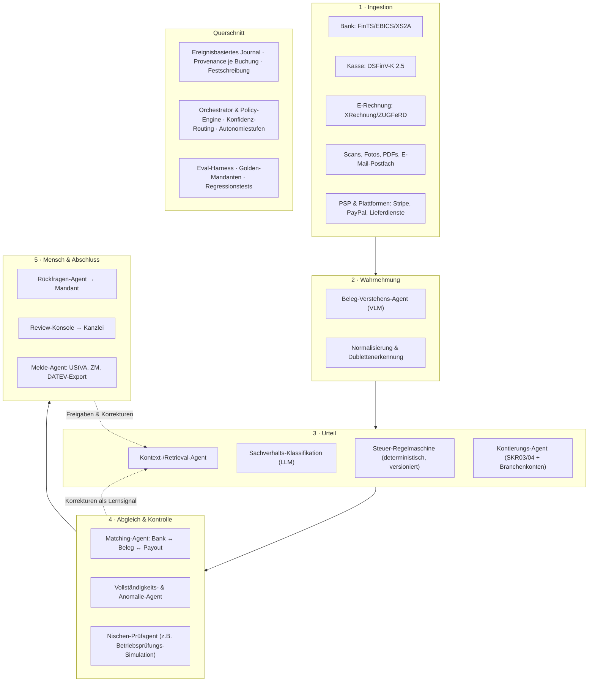

# KI-Buchhaltung als Nischenprodukt — Nischenvergleich, SWOT und Agenten-Architektur

*Strategiepapier, Stand August 2026. Alle Marktzahlen mit Quelle am Ende; als "Größenordnung" markierte Werte sind vor einer Investitionsentscheidung zu verifizieren.*

---

## 1. Ausgangslage: warum eine Nische die richtige Entscheidung ist

**Der Wettbewerber.** mika (Get Mika GmbH, Berlin) positioniert sich als KI-Buchhaltung für Gründer und kleine Unternehmen — Zielgruppe bis ca. 50 Mitarbeiter und 10 Mio. € Umsatz, Einstieg ab 49 €/Monat, Paket inkl. Jahresabschluss ab 99 €/Monat. Das Produkt ist bewusst branchenneutral: Belege lesen, kontieren, Behördenpost interpretieren, Bank abgleichen.

**Warum du das horizontal nicht gewinnst.** Der horizontale Markt ist besetzt und teuer:

- **Oben** sitzt DATEV mit dem Kanzlei-Ökosystem als faktischem Standard. Jede Buchhaltung endet früher oder später in DATEV.
- **In der Mitte** sitzen lexware/lexoffice, sevdesk, Papierkram, Buchhaltungsbutler, FastBill — hohe Markenbekanntheit, Preisanker bei 15–40 €/Monat.
- **Neu daneben** stehen die KI-nativen Player (mika, Beancount-artige Neugründungen, Kanzlei-Startups wie Ageras/Felix1-Nachfolger).

Horizontal konkurrierst du auf drei Achsen gleichzeitig: Feature-Parität, Markenvertrauen und Preis. Alle drei kosten Kapital, keine davon gewinnst du mit einem besseren Agenten.

**Was eine Nische strukturell ändert.** In einer Branche mit eigener Steuerlogik verschiebt sich die Konkurrenz von "Wer hat mehr Features?" zu "Wer versteht §13b?". Konkret bekommst du vier Dinge, die horizontal nicht kaufbar sind:

1. **Ein engeres Ontologie-Problem.** Ein branchenneutraler Agent muss jeden denkbaren Geschäftsvorfall kontieren können. Ein Gastro-Agent muss ca. 300 wiederkehrende Vorfälle sehr gut können. Das ist der Unterschied zwischen 85 % und 97 % Automatisierungsquote — und genau dort liegt die Marge.
2. **Einen Compliance-Burggraben.** Branchenspezifisches Steuerrecht (Kassenrecht, Bauabzugsteuer, OSS) ist Arbeit, die ein Generalist nicht nebenbei nachbaut, weil sie für 95 % seiner Kunden irrelevant ist.
3. **Bezahlbare Kundengewinnung.** Verbände, Innungen, Großhändler, Kassenhersteller und spezialisierte Kanzleien sind Multiplikatoren mit Vertrauensvorschuss. Horizontal bleibt dir Google Ads gegen Konzernbudgets.
4. **Höhere Preise.** Buchhaltung ist Commodity und kostet 30 €. "Ich überlebe die Kassennachschau" ist Risikoabsicherung und kostet 200 €.

**Rückenwind, den du nicht selbst erzeugen musst:** Die E-Rechnungspflicht. Empfangspflicht gilt seit dem 1.1.2025 für alle inländischen Unternehmen; die Ausstellungspflicht greift ab 1.1.2027 für Unternehmen mit über 800.000 € Vorjahresumsatz und ab 1.1.2028 für alle inländischen B2B-Umsätze. Das heißt: In genau deinem Gründungsfenster muss jeder Betrieb in Deutschland seine Rechnungsprozesse anfassen. Das ist das größte erzwungene Software-Wechselfenster im deutschen Mittelstand seit der Umstellung auf SEPA.

---

## 2. Bewertungsraster

Acht Kriterien, gewichtet nach ihrer Aussagekraft für ein KI-natives Produkt eines kleinen Teams. Skala 1–5.

| # | Kriterium | Gewicht | Warum dieses Gewicht |
|---|---|---|---|
| K1 | Marktgröße (Anzahl adressierbarer Betriebe) | 1,0 | Fast jede Nische ist groß genug für 20 Mio. € ARR. Selten der Engpass. |
| K2 | Zahlungsbereitschaft / ARPA | 1,5 | Entscheidet, ob du Vertrieb mit Menschen finanzieren kannst. |
| K3 | Schmerzintensität (Compliance-Risiko + Zeitaufwand) | 1,5 | Existenzangst verkauft, Bequemlichkeit nicht. |
| K4 | **KI-Hebel** (Anteil unstrukturierter Arbeit, den ein Agent wirklich übernimmt) | **2,0** | Das ist dein einziger echter Produktvorteil. Wo Daten schon strukturiert sind, ist KI kein Differenzierer. |
| K5 | Datenzugang (APIs, gesetzlich erzwungene Formate) | 1,5 | Ohne verlässlichen Input kein Agent. Pflichtformate sind geschenkte Infrastruktur. |
| K6 | Wettbewerbslücke | 1,5 | |
| K7 | GTM-Zugänglichkeit (Multiplikatoren, CAC) | 1,0 | |
| K8 | Verteidigbarkeit | 1,0 | |

**Der wichtigste und meistübersehene Punkt ist K4.** Die intuitive Antwort auf "Wo lohnt sich KI-Buchhaltung?" lautet "Da, wo die Daten sauber sind". Das ist falsch herum gedacht. Wo die Daten sauber sind, reicht eine Regelmaschine und du konkurrierst gegen bestehende Integrationen. Der KI-Hebel ist maximal, wo täglich Papier, PDFs mit 200 Positionen, Fotos vom Lieferschein und Bargeld anfallen — also genau in den Branchen, die Software bisher gemieden hat.

---

## 3. Nischenvergleich (Longlist mit Scoring)

| Nische | K1 Markt | K2 ARPA | K3 Schmerz | K4 KI-Hebel | K5 Daten | K6 Lücke | K7 GTM | K8 Moat | **Score** (max 55) |
|---|:--:|:--:|:--:|:--:|:--:|:--:|:--:|:--:|:--:|
| **N2 Gastronomie & Food-Service** | 4 | 3 | 5 | 5 | 5 | 4 | 4 | 4 | **47,5** |
| **N3 Handwerk & Bau-Nebengewerbe** | 5 | 4 | 4 | 5 | 3 | 4 | 3 | 4 | **44,5** |
| **N3b E-Commerce-GmbH, hohes Volumen** † | 2 | 5 | 5 | 3 | 5 | 4 | 4 | 4 | **44,5** |
| **N1 E-Commerce / Marktplatzhändler (breit)** | 3 | 4 | 5 | 2 | 5 | 3 | 4 | 3 | **39,5** |
| **N8 Transport, Kurier & Sub-Spedition** | 3 | 3 | 4 | 4 | 4 | 4 | 3 | 3 | **39,5** |
| N4 Heilberufe & Praxen | 3 | 5 | 3 | 3 | 3 | 3 | 3 | 3 | 36,0 |
| N5 Vermieter & kleine WEG-Verwaltung | 4 | 2 | 3 | 4 | 3 | 3 | 3 | 3 | 34,5 |
| N6 Vereine & gemeinnützige Organisationen | 4 | 1 | 4 | 4 | 2 | 5 | 2 | 2 | 34,0 |
| N7 Agenturen & Professional Services | 3 | 3 | 2 | 3 | 4 | 1 | 3 | 1 | 28,0 |
| N9 Vermögensverwaltende Holdings („Spardosen-GmbH") † | 2 | 4 | 3 | 1 | 3 | 3 | 4 | 3 | 30,5 |
| N10 Self-Hosted / Open Source † | 2 | 1 | 2 | 3 | 2 | 4 | 3 | 1 | 25,5 |

† Nachträglich geprüfte Ansätze, siehe Abschnitt 9.

### Kurzbegründungen der nicht weiterverfolgten Nischen

**N7 Agenturen & Beratung — nicht machen.** Das ist exakt mikas Zielgruppe und die von lexoffice/sevdesk. Die Buchhaltung ist fachlich langweilig (Dienstleistung, 19 %, gelegentlich Reverse Charge), es gibt keine branchenspezifische Steuerlogik, die einen Burggraben bildet. Du wärst "mika, aber für Agenturen" — eine Positionierung ohne Substanz.

**N6 Vereine — schöner Schmerz, kein Geschäft.** Die Sphärenrechnung (ideeller Bereich, Vermögensverwaltung, Zweckbetrieb, wirtschaftlicher Geschäftsbetrieb) ist fachlich anspruchsvoll und softwareseitig sträflich unterversorgt — deshalb K6=5. Aber: Der Käufer ist ein ehrenamtlicher Kassenwart ohne Budget und ohne Mandat, Software zu beschaffen. ARPA 5–15 €/Monat trägt keinen Vertrieb. Später als Selfservice-Nebenprodukt denkbar, nicht als Kern.

**N4 Heilberufe — höchster ARPA, falscher Schmerz.** Praxen zahlen bereitwillig, aber ihr Schmerz liegt in der *Abrechnung* (GOÄ/KV/PVS), nicht in der Buchhaltung. Buchhalterisch sind sie eher einfach: überwiegend nach § 4 Nr. 14 UStG steuerfreie Umsätze, EÜR, wenig Vorsteuer. Dazu sind spezialisierte Kanzleien tief verankert. Du würdest in einen zähen Verdrängungskampf gehen für ein Problem, das der Kunde nicht als sein größtes empfindet.

**N5 Vermietung & WEG — angrenzendes Produkt, nicht Buchhaltung.** Der Schmerz ist real (Anlage V, Nebenkostenabrechnung, AfA-Verteilung, Objektzuordnung), aber der Markt ist bereits von Verwalter-Software besetzt (casavi, Objego, Vermietet.de) und private Vermieter zahlen 5–20 €/Monat. Als späterer Zweitmarkt interessant.

**N8 Transport & Sub-Spedition — der unterschätzte Außenseiter.** Gleichauf mit E-Commerce, und ich halte ihn für unterrecherchiert: Gutschriftsverfahren mit Frachtführern, Maut- und Tankkartenabrechnungen im CSV-Format, Fahrer-Lohnthemen, Nachunternehmerhaftung, viel Kleinstunternehmertum. Wenn du persönlichen Zugang zu dieser Branche hast, gehört sie in die Shortlist.

---

## 4. Deep Dive: die drei Finalisten

Jeweils: konkrete Produktdefinition (kein Kategorielabel, sondern was die Software tut), das eine Feature, das dich unkopierbar macht, und eine ungeschönte SWOT.

---

### 4.1 Nische A — Gastronomie & Food-Service *(Arbeitstitel: "Tresen")*

**Marktbild.** Das Gastgewerbe setzte 2024 rund 115,9 Mrd. € netto um und beschäftigt über 2,2 Mio. Menschen; Größenordnung 200.000–230.000 Unternehmen (zu verifizieren). Die Lage ist angespannt: In der DEHOGA-Konjunkturumfrage vom Februar 2026 bewerteten nur 19,3 % der Betriebe ihre Situation als gut.

**Der eigentliche Schmerz ist nicht Buchhaltung, sondern Prüfungsangst.** Bei einer Kassen-Nachschau nach § 146b AO erscheint das Finanzamt unangekündigt, macht Testkäufe, verlangt den DSFinV-K-Export und zählt die Kasse. Findet es formelle Mängel, folgt die Hinzuschätzung — und die ist existenzbedrohend, weil sie auf Annahmen beruht, gegen die man schwer argumentiert. Dazu Bußgelder bis 25.000 € und die Meldepflicht elektronischer Kassensysteme über ELSTER. Kein Gastronom liegt wegen seiner Kontierung wach. Wegen der Prüfung schon.

**Produktdefinition.** Ein Agentensystem, das:

- täglich den **DSFinV-K-Export** aus dem Kassensystem zieht (Version 2.5) und Z-Bons, Einzelaufzeichnungen, TSE-Signaturen und Zahlarten in Buchungen überführt;
- **Kartenumsätze gegen PSP-Auszahlungen** abgleicht — inklusive Gebühren, Trinkgeld, Gutscheinverkauf vs. -einlösung, Lieferdienst-Provisionen (Lieferando, Uber Eats, Wolt) und deren zeitversetzter Auszahlung;
- **Lieferantenrechnungen auf Positionsebene** liest (Metro, Getränkefachgroßhandel, Frischdienst — regelmäßig 100–300 Positionen) und den **7 %/19 %-Split** pro Position vornimmt statt pro Rechnung;
- das **digitale Kassenbuch** mit fortlaufender Bestandsplausibilisierung führt (kein negativer Kassenbestand, Privatentnahmen, Wechselgeld, Trinkgeldkasse);
- **Eigenverbrauch, Personalverpflegung und Sachbezugswerte** automatisch ansetzt — der Klassiker jeder Prüfungsfeststellung;
- die **UStVA vorbereitet**, die **Verfahrensdokumentation** laufend fortschreibt und alles DATEV-fertig an die Kanzlei übergibt.

**Das unkopierbare Feature: die Betriebsprüfungs-Simulation.**
Der Agent lässt monatlich genau die Routinen gegen die eigenen Daten laufen, die ein Prüfer anwenden würde — Zeitreihenvergleich, Chi-Quadrat-Test, Benford-Analyse der Tageseinnahmen, Suche nach negativen Kassenbeständen, Storno- und Trainingskellner-Quoten, Auffälligkeiten in der Zahlartenverteilung, Lücken in der Belegnummernfolge — und liefert einen **Prüfungsbereitschafts-Score mit konkreter Mängelliste und Fristen**. Das verwandelt ein unsichtbares Risiko in eine abarbeitbare Liste. Es ist gleichzeitig das beste Verkaufsargument überhaupt: Der Score im kostenlosen Erst-Check ist der Lead-Magnet.

#### SWOT — "Tresen"

**Stärken**
- **Gesetzlich erzwungene, maschinenlesbare Datenquelle.** DSFinV-K ist der einzige Fall in der deutschen KMU-Landschaft, in dem der Staat dir eine standardisierte Schnittstelle zum Kernprozess des Kunden vorschreibt. Du bekommst geschenkt, wofür man in anderen Branchen 20 Integrationen bauen muss.
- **Der KI-Hebel ist maximal und beweisbar.** Die Positionssplittung einer 240-zeiligen Metro-Rechnung nach 7/19 % ist Arbeit, die heute Menschen manuell machen oder — häufiger — pauschal falsch schätzen. Der Wertbeweis passiert in der ersten Demo-Minute.
- **Verkauft wird Risikoabsicherung, nicht Zeitersparnis.** Damit umgehst du den Preisanker "sevdesk kostet 20 €".
- **Klar identifizierbare Vertriebskanäle mit Vertrauensvorschuss:** Kassenhersteller (orderbird, gastronovi, Lightspeed, ready2order), Großhändler, DEHOGA-Landesverbände, spezialisierte Gastro-Kanzleien.
- **Hohe Frequenz erzeugt Datenvorsprung.** Ein Restaurant produziert täglich Belege. Das Mandanten-Gedächtnis deines Agenten ist nach acht Wochen besser als bei einem Agenturkunden nach zwei Jahren.

**Schwächen**
- **Du verkaufst an eine notleidende Branche.** Nur 19,3 % bewerten ihre Lage als gut. Preissensibilität ist extrem, Insolvenz- und Betriebsaufgabequoten sind hoch — Churn, den du nicht durch Produktqualität verhinderst. Kalkuliere von Anfang an mit 2,5–4 % monatlichem Logo-Churn.
- **Niedriger ARPA bei hohem Belegvolumen.** Die kostenintensivste Nische bei der zweitniedrigsten Zahlungsbereitschaft der Shortlist. Deine Marge steht und fällt mit den Inferenzkosten pro Beleg — das ist eine harte Engineering-Anforderung, kein Detail.
- **Fragmentierte Kassenlandschaft.** Dutzende Systeme, DSFinV-K-Exporte in unterschiedlicher Qualität, viele nur über Umwege oder Händlerzugänge erreichbar. Der Export ist gesetzlich standardisiert — der *Zugriff darauf* ist es nicht.
- **Bargeld bleibt teilweise unauflösbar.** Wo der Betrieb schlampt oder bewusst nicht alles erfasst, kann dein Agent das nur melden, nicht lösen. Ein Teil deiner Zielgruppe *will* diese Transparenz nicht — das ist ein echter, selten ausgesprochener Marktanteilsverlust.
- **Saisonalität und Standortstruktur** verkomplizieren Preismodell und Cashflow.

**Chancen**
- **Kassenhersteller als Distributionspartner statt als Vertriebskosten.** Sie haben die Installationsbasis, aber kein Interesse, Steuerrecht zu bauen. Eine White-Label- oder Revenue-Share-Partnerschaft kann deine CAC halbieren.
- **Der Prüfungsdruck steigt.** Meldepflicht, DSFinV-K 2.5, verschärfte Nachschau-Praxis — die Nachfrage nach dem Score wächst, ohne dass du Bedarf wecken musst.
- **Die Kanzlei als Kunde, nicht nur als Partner.** Gastro-Mandate gelten in Kanzleien als unbeliebt. Ein Werkzeug, das das Vorkontieren übernimmt, verkauft sich an spezialisierte Kanzleien mit 30 Mandaten — ein einziger Abschluss bringt 30 Betriebe.
- **Angrenzende Erlösquellen** mit derselben Datenbasis: Wareneinsatzquote je Warengruppe, Deckungsbeitrag je Gericht, Personalkostenquote, Lieferantenpreis-Benchmarking. Das ist Controlling, das kein Gastronom heute hat, und es rechtfertigt einen zweiten Preisplan.
- **Mehrbetrieb-Kunden** (kleine Ketten, Franchise, Systemgastronomie) heben den ARPA um eine Größenordnung, bei fast identischem Produkt.

**Risiken**
- **Der Kassenhersteller baut es selbst.** Er sitzt näher an den Daten als du. Gegenmittel: Die Steuerlogik und die Kanzlei-Beziehung sind der Teil, den er nicht will — konzentriere dich darauf und werde für ihn zum Zukauf, nicht zum Wettbewerber.
- **Haftung.** Wenn dein Prüfungs-Score "grün" sagt und die Prüfung endet mit einer sechsstelligen Hinzuschätzung, hast du ein Problem — juristisch, spätestens aber im Vertrauen des Markts. Der Score muss als Selbstdiagnose-Werkzeug ohne Zusicherung formuliert sein, mit Kanzleifreigabe an jeder Stelle, an der eine steuerliche Aussage entsteht. Berufshaftpflicht vor dem ersten Kunden.
- **Der berufsrechtliche Rahmen.** § 6 Nr. 4 StBerG erlaubt das Buchen laufender Geschäftsvorfälle nur unter Qualifikationsauflagen; **das Kontieren von Belegen und das Erteilen von Buchungsanweisungen sind ausdrücklich nicht Teil der erlaubten mechanischen Tätigkeit**, ebenso wenig die Erstellung der Umsatzsteuer-Voranmeldung oder die Einrichtung der Buchführung. Reine Software als Werkzeug in der Hand des Unternehmers ist unproblematisch — sobald du es *als Dienstleistung für ihn* tust, brauchst du einen Steuerberater in der Verantwortung. Das ist Architektur- und Gesellschaftsrechtsfrage zugleich, siehe Abschnitt 6.
- **Konzentrationsrisiko im Kanal.** Hängst du an einem Kassenhersteller, ist dein Unternehmen dessen Verhandlungsmasse.

---

### 4.2 Nische B — Handwerk & Bau-Nebengewerbe *(Arbeitstitel: "Polier")*

**Marktbild.** 1.038.126 Betriebe zum Jahresende 2025, rund 6 Mio. Beschäftigte, 783,2 Mrd. € Umsatz. Das ist die mit Abstand größte Nische der Liste — und die am wenigsten digitalisierte.

**Der Schmerz.** Steuerlich ist Bau die komplexeste Kleinbetriebs-Branche Deutschlands: Reverse Charge bei Bauleistungen nach § 13b UStG (mit der berüchtigten Frage, ob der Kunde selbst Bauleistender ist), Abschlags- und Schlussrechnungen mit korrekter Umsatzsteuerabgrenzung, Bauabzugsteuer nach § 48 EStG mit 15 % Einbehalt ohne gültige Freistellungsbescheinigung, Nachunternehmerhaftung für Sozialabgaben und Mindestlohn. Dazu operativ: Materialbelege auf dem Beifahrersitz, Sammelrechnungen des Großhandels mit Lieferscheinbezug, jede Kostenposition gehört auf eine Baustelle.

**Produktdefinition.** Ein Agentensystem, das:

- **Materialbelege und Großhandels-Sammelrechnungen** liest und Positionen auf Baustellen/Aufträge verteilt — auch aus abfotografierten Lieferscheinen;
- **§ 13b automatisch erkennt und begründet**, statt es dem Kunden als Checkbox hinzuwerfen;
- **Abschlagsrechnungen korrekt fortschreibt** und bei der Schlussrechnung die kumulierten Abschläge samt Umsatzsteuer sauber auflöst — eine der häufigsten Fehlerquellen überhaupt;
- **§ 48 EStG durchsetzt**: Freistellungsbescheinigungen aller Subunternehmer erfassen, Gültigkeit überwachen, Zahlung ohne gültige Bescheinigung blockieren, Steueranmeldung vorbereiten;
- **E-Rechnungs-Readiness** für 2027/2028 herstellt (XRechnung/ZUGFeRD in beide Richtungen);
- als Nebenprodukt die **Nachkalkulation je Baustelle** liefert — Material + Stunden + Fremdleistung gegen Angebot.

**Das unkopierbare Feature: der Subunternehmer-Wächter.**
Ein Agent, der für jeden Nachunternehmer permanent den Haftungsstatus führt: Freistellungsbescheinigung nach § 48b EStG (gültig? läuft ab?), Unbedenklichkeitsbescheinigungen, Anzeichen für Scheinselbstständigkeit, Mindestlohn-Nachweise (§ 13 MiLoG), Generalunternehmerhaftung nach § 28e SGB IV. Vor jeder Zahlungsfreigabe eine Ampel. Das ist kein Buchhaltungsfeature — das ist eine Versicherung gegen fünf- bis sechsstellige Nachforderungen, und es adressiert den Inhaber, nicht die Bürokraft.

#### SWOT — "Polier"

**Stärken**
- **Größter Markt der Shortlist** und höchste Regulierungsdichte — die Kombination, in der Spezialisierung am meisten wert ist.
- **Der KI-Hebel ist maximal**, weil der Input maximal unstrukturiert ist: Fotos, Lieferscheine, handschriftliche Notizen, Sammelrechnungen. Genau der Bereich, in dem klassische Software seit 20 Jahren scheitert.
- **Steuerlogik als Burggraben.** § 13b, § 48 EStG und die Abschlagsrechnungs-Systematik korrekt zu implementieren ist Monate an Fachaufwand. Ein Generalist wird das nie priorisieren.
- **Hohe Zahlungsbereitschaft beim Inhaber**, wenn das Produkt als Haftungsschutz und Nachkalkulation verkauft wird — nicht als Buchhaltung.
- **Bestehende Handwerkersoftware ist Verbündeter, nicht Gegner.** ToolTime etwa hat eine DATEV-zertifizierte Schnittstelle auf Basis des Rechnungsdatenservice gebaut — das zeigt das Muster: Diese Anbieter *liefern Rechnungsdaten ab*, sie machen keine Buchhaltung. Zwischen Handwerkersoftware und DATEV klafft genau die Lücke, die du füllst.

**Schwächen**
- **Kein Pflichtformat, keine geschenkten Daten.** Anders als Gastro gibt es keinen DSFinV-K. Du baust jede Datenquelle einzeln — bis die E-Rechnungspflicht 2027/28 greift. Bis dahin trägst du Integrationslast.
- **Der härteste Vertrieb der Liste.** Der Entscheider ist auf der Baustelle, liest keine E-Mails, kauft über Empfehlung und persönlichen Kontakt. Produktgetriebenes Wachstum funktioniert hier praktisch nicht; du brauchst Außendienst, Innungen, Messen — teuer und langsam. **Das ist der Hauptgrund, warum diese Nische trotz größerem Markt hinter Gastro liegt.**
- **Lange Verkaufszyklen und hohe Onboarding-Reibung.** Bestehende Handwerkersoftware sitzt fest im Betriebsablauf; du musst dich daneben setzen, nicht ersetzen.
- **Extreme Heterogenität.** SHK, Elektro, Maler, Dachdecker, Garten- und Landschaftsbau haben unterschiedliche Kostenstrukturen, Großhändler und Gewohnheiten. "Handwerk" ist keine Nische, sondern zehn. Du musst auf zwei bis drei Gewerke fokussieren.

**Chancen**
- **Die E-Rechnungspflicht ist ein Zwangs-Onboarding-Ereignis.** Ab 2027 (>800.000 € Umsatz) und 2028 (alle) muss jeder Betrieb seine Rechnungsprozesse umstellen. Wer 2026/27 mit einer Antwort dasteht, gewinnt Kunden zu einem Bruchteil der normalen CAC. **Das Zeitfenster ist jetzt und schließt sich Ende 2028.**
- **Handwerkersoftware-Anbieter als Einbettungspartner:** Sie brauchen eine Buchhaltungs-Antwort, wollen sie aber nicht bauen.
- **Innungen und Handwerkskammern** als Multiplikatoren mit außergewöhnlich hoher Vertrauenswirkung — einmal aufgebaut, schwer angreifbar.
- **Nachkalkulation als Trojanisches Pferd:** Der Betrieb kauft "Ich sehe endlich, welche Baustelle Geld verdient" und bekommt die Buchhaltung dazu. Das dreht ein Kostenprodukt in ein Umsatzprodukt.

**Risiken**
- **Die etablierten Handwerks-ERPs wachen auf.** pds, Streit, Label, Sander sowie die jungen Anbieter (ToolTime, Plancraft, HERO) sitzen näher am Kunden und haben den Vertrieb bereits bezahlt. Sie sind langsam — aber wenn einer von ihnen Buchhaltung ernst nimmt, ist dein Vorsprung nur der Steuer-Layer.
- **Fehlerkosten sind asymmetrisch.** Eine falsch beurteilte § 13b-Leistung erzeugt echte Steuernachzahlungen. In dieser Nische ist die Genauigkeitsanforderung deutlich höher als in Gastro, wo Fehler meist Klassifikationsfragen sind.
- **Cashflow-Zyklen der Branche** (Zahlungsziele, Bauinsolvenzen) schlagen auf dein Inkasso durch.
- **Berufsrechtliche Grenze** identisch zu Gastro (§ 5 / § 6 StBerG), verschärft dadurch, dass § 13b-Beurteilung sehr nah an Steuerberatung liegt — hier muss die Kanzlei strukturell im Loop sein.

---

### 4.3 Nische C — E-Commerce / Marktplatzhändler *(Arbeitstitel: "Payout")*

**Marktbild.** Größenordnung 80.000–150.000 buchhaltungsrelevante Händler in Deutschland (zu verifizieren). Digital erreichbar, technikaffin, hohe Wechselbereitschaft.

**Aktuelle Marktbewegung — und der Grund, warum diese Nische trotz mittelmäßigem Score auf der Liste steht.** Taxdoo, der prägende Anbieter der Kategorie, stellt seinen zentralen Umsatzsteuer-Service zum 30.04.2026 ein und fokussiert sich auf Real-Time-Accounting. Damit ist ein etablierter Anbieter mitten in der Migration seiner eigenen Kunden. countX, Amainvoice und hellotax positionieren sich als Nachfolger. Es gibt gerade ein offenes Zeitfenster mit wechselwilligen Kunden — aber es ist ein *Wechsel*fenster, kein Vakuum.

**Produktdefinition.** Ein Agentensystem, das Marktplatz- und PSP-Rohdaten (Amazon SP-API, Shopify, eBay, Stripe, PayPal, Klarna, Mollie) in eine vollständige Buchhaltung überführt: Auszahlung auf den Cent in Umsatz, Gebühren, Retouren, Gutschriften, Werbekosten und Steuerkonten zerlegt; OSS-Meldung und innergemeinschaftliche Verbringungen bei PAN-EU/CEE-Lagerung; § 22f/§ 25e-Themen; Bestandsbewertung zum Abschlussstichtag; DATEV-Export.

**Das unkopierbare Feature: Cent-genaue Payout-Auflösung mit Bestandsbewertung** — der Übergang von "Umsatzsteuer-Compliance" zu "vollständiger, abschlussfähiger Buchhaltung", also genau die Lücke, die der Rückzug von Taxdoos USt-Service und dessen Pivot zu Real-Time-Accounting am Markt sichtbar macht.

#### SWOT — "Payout"

**Stärken**
- **Bester Datenzugang der Liste.** Alles über APIs, kein Papier, kein Bargeld, sofortiges Onboarding ohne Außendienst.
- **Niedrigste CAC.** Zielgruppe digital erreichbar, aktiv in Foren, Facebook-Gruppen, auf Messen wie der Amazon-Seller-Szene.
- **Echter, akuter Schmerz** mit klarer Geldgröße: falsche USt-Behandlung im EU-Versandhandel kostet unmittelbar.
- **Skaliert international**, weil das Problem in AT/CH/NL/FR strukturell identisch ist — die einzige Nische der Liste ohne deutschen Länderdeckel.

**Schwächen**
- **Der KI-Hebel ist strukturell schwach — und das ist der entscheidende Einwand.** Die Daten kommen bereits strukturiert aus APIs. Das Problem ist ein Regel-, Mapping- und Compliance-Problem, kein Verstehensproblem. Damit ist dein Kernvorteil — Agenten, die Unstrukturiertes verstehen — hier weitgehend wertlos. Du konkurrierst auf Regelabdeckung und Integrationsbreite, also auf dem Feld der Etablierten.
- **Am dichtesten besetzt.** countX, Amainvoice, hellotax, taxomate, JTL/plentymarkets-Ökosystem plus spezialisierte E-Commerce-Kanzleien.
- **Hohe Kundenvolatilität.** Amazon-Händler kommen und gehen; Marktplatz-Regeländerungen können Kundensegmente über Nacht vernichten.
- **Integrations-Tretmühle.** Marktplatz- und PSP-APIs ändern sich ständig; ein wachsender Teil deines Teams pflegt dauerhaft Schnittstellen statt Produkt zu bauen.

**Chancen**
- **Das Taxdoo-Migrationsfenster** (Service-Ende 30.04.2026) — wechselwillige, bereits von der Kategorie überzeugte Kunden ohne Missionierungsaufwand.
- **Aufstieg von Compliance zur vollen Buchhaltung**: Die bestehenden Anbieter sind USt-zentriert; wer den Jahresabschluss vorbereitet, hebt den ARPA deutlich und erhöht die Wechselkosten.
- **EU-Expansion** ohne Neupositionierung.

**Risiken**
- **Nach dem Migrationsfenster ist der Markt konsolidiert und du bist zu spät.** Das Fenster ist Monate, nicht Jahre — und du müsstest jetzt bereits ein fertiges Produkt haben, das du nicht hast. **Das ist der harte Einwand gegen diese Nische: Die Chance existiert, aber nicht in deinem Bauzeitfenster.**
- **Plattformabhängigkeit.** Amazon kann Reporting-Formate ändern oder Steuerfunktionen selbst anbieten und dir Teile der Wertschöpfung entziehen.
- **Preisverfall**, weil das Angebot standardisiert und leicht vergleichbar ist.

---

## 5. Empfehlung

**Primärempfehlung: Gastronomie & Food-Service.**

Die Begründung in einem Satz: Es ist die einzige Nische, in der dir der Gesetzgeber gleichzeitig eine standardisierte Datenschnittstelle (DSFinV-K), einen existenziellen Kaufanlass (Kassen-Nachschau mit Hinzuschätzungsrisiko) und einen konzentrierten Vertriebskanal (Kassenhersteller) auf einmal liefert — und in der dein Kernvorteil, das Verstehen unstrukturierter Belege, den größten messbaren Unterschied macht.

Die harte Gegenrechnung, die du kennen musst: Du verkaufst an eine wirtschaftlich angeschlagene Branche mit hohem Churn und niedrigem ARPA. Dieses Geschäftsmodell funktioniert nur, wenn deine Grenzkosten pro Beleg im niedrigen Cent-Bereich liegen und dein Vertrieb über Partner statt über eigene Vertriebsmitarbeiter läuft. Beides ist eine Konstruktionsvorgabe ab Tag eins, keine Optimierung für später.

**Entscheidungsregel, falls deine Ausgangslage anders ist:**

| Wenn ... | dann ... |
|---|---|
| du persönlichen Zugang zu Innungen, HWK oder einer Handwerkersoftware hast | **Handwerk/Bau** — größerer Markt, höherer ARPA, und das E-Rechnungs-Fenster 2027/28 löst dein GTM-Problem. Dann aber sofort starten. |
| du bereits E-Commerce-Kunden oder eine Taxdoo-Migrationspipeline hast | **E-Commerce** — nur mit bestehendem Zugang, das Fenster ist zu kurz für einen Kaltstart. |
| du Kapital für Außendienst hast und in 5 Jahren denkst | **Handwerk/Bau** — die größte Endposition. |
| du mit kleinem Team schnell zu belegbarer Automatisierungsquote willst | **Gastronomie** — schnellste Zeit bis zum harten Wertbeweis. |

**Kill-Kriterien für die Gastro-Entscheidung — prüfe diese vier Dinge in den nächsten 30 Tagen, bevor du Code schreibst:**

1. **Datenzugang.** Kommst du bei den drei bis fünf verbreitetsten Kassensystemen ohne Herstellervertrag an einen automatisierten DSFinV-K-Export? Wenn nein, ist deine gesamte These vom "geschenkten Pflichtformat" hinfällig.
2. **Zahlungsbereitschaft.** Nennen dir 10 von 15 befragten Betrieben von sich aus die Prüfungsangst als Top-3-Sorge, und akzeptieren mindestens 5 einen Preis ab 149 €/Monat?
3. **Kanzlei-Partner.** Findest du eine gastro-spezialisierte Kanzlei, die bereit ist, als Freigabeinstanz im Produkt zu stehen? Ohne sie ist der berufsrechtliche Rahmen nicht sauber lösbar.
4. **Belegkosten.** Kannst du eine 240-Positionen-Metro-Rechnung für unter 5 Cent Inferenzkosten in korrekte Positionsbuchungen mit 7/19 %-Split überführen? Rechne das an einem Prototyp durch, nicht auf Papier.

---

## 6. Architektur der KI-Agenten im Hintergrund

### 6.1 Das Grundprinzip: deterministischer Kern, LLM am Rand

Der häufigste und teuerste Architekturfehler in diesem Feld: ein großes Modell, das den Beleg sieht und den Buchungssatz ausgibt. Das ist demotauglich und produktionsuntauglich, weil es nicht auditierbar, nicht testbar, nicht versionierbar und in der Fläche nicht genau genug ist.

Die tragfähige Aufteilung:

> **Das LLM stellt Sachverhalte fest. Die Regelmaschine zieht die steuerlichen Schlüsse. Ein LLM rechnet niemals einen Betrag aus und wählt niemals frei ein Konto.**

Konkret: Das Modell beantwortet Fragen wie "Ist das eine Bauleistung im Sinne von § 13b?", "Ist diese Position ein Getränk oder ein Lebensmittel?", "Ist der Leistungsempfänger ein Unternehmer im EU-Ausland?". Aus diesen Feststellungen leitet eine versionierte, deterministische Regelbasis Konto, Steuerschlüssel und Beträge ab. Nur so ist jede Buchung auf eine Regel-ID und eine Belegstelle zurückführbar — und genau das verlangt die GoBD-Nachvollziehbarkeit ohnehin.

### 6.2 Schichtenmodell

### 6.3 Die Agenten im Einzelnen

| # | Agent | Aufgabe | Technik | LLM-Anteil |
|---|---|---|---|---|
| 1 | **Ingestion** | Bank (FinTS/EBICS/XS2A-Aggregator), DSFinV-K, XRechnung/ZUGFeRD, E-Mail-Postfach, Foto-Upload, PSP-APIs | klassischer Code, Parser, Konnektoren | keiner |
| 2 | **Beleg-Verstehen** | Bild/PDF → strukturiertes Belegobjekt inkl. Positionen; **Feldkonfidenz und Fundstelle (Bounding Box) je Wert** | Vision-Modell + Layout-Parser | hoch |
| 3 | **Dubletten & Normalisierung** | gleicher Beleg über drei Kanäle, Lieferantenidentität, Währungen, Rundungen | Fuzzy-Matching, Hashing | keiner |
| 4 | **Kontext/Retrieval** | Wie wurde dieser Lieferant bisher gebucht? Stammdaten, Verträge, Vorjahresbuchungen als Few-Shot-Kontext | Vektorindex + Regeltreffer **je Mandant getrennt** | mittel |
| 5 | **Sachverhalts-Klassifikation** | Ausschließlich Feststellungen, keine Steuerfolgen: Leistungsart, Ort, Empfängereigenschaft, Warengruppe | LLM, eng geführte Ausgabeschemata | hoch |
| 6 | **Steuer-Regelmaschine** | Feststellungen → Steuerschlüssel, Bemessungsgrundlage, Beträge. § 13b, § 4 Nr. 14, § 19, § 25a, OSS, 7/19 % | deterministische Regel-DSL, **zeitlich versioniert** | keiner |
| 7 | **Kontierung** | Konto nach SKR03/04 plus branchenspezifischer Kontenlogik | Regeln + gelernte Mandantenpräferenz | niedrig |
| 8 | **Matching** | Bank ↔ Beleg ↔ Kassenumsatz ↔ PSP-Auszahlung; Teilzahlungen, Skonto, Gebühren, Sammelüberweisungen | kombinatorische Optimierung, **kein LLM** | keiner |
| 9 | **Vollständigkeit & Anomalie** | Belegnummernlücken, fehlende Eingangsrechnungen zu Zahlungen, unplausible Beträge, negative Kassenbestände | Statistik + Regeln | niedrig |
| 10 | **Nischen-Prüfagent** | Gastro: Prüfungssimulation (Zeitreihe, Chi-Quadrat, Benford, Stornoquoten). Bau: Freistellungsbescheinigungs- und Haftungswächter | branchenspezifisch | mittel |
| 11 | **Rückfragen** | Offene Punkte zu **einer** verständlichen Frage bündeln, per WhatsApp/App/E-Mail, Antwort strukturiert zurückschreiben | LLM für Formulierung, Regeln für Auswahl | mittel |
| 12 | **Melden & Abschließen** | UStVA-Entwurf, ZM, DATEV-Export (EXTF/Rechnungsdatenservice), Abschlussvorbereitung — **immer mit Kanzleifreigabe** | Code + Freigabe-Workflow | keiner |
| 13 | **Orchestrator/Supervisor** | Reihenfolge, Wiederholungen, Eskalation, Kostenbudget je Beleg, Autonomiestufen | Zustandsmaschine, kein autonomer Planer | niedrig |

**Zum Orchestrator eine bewusste Einschränkung:** Kein frei planender Agent. Buchhaltung ist ein Prozess mit bekannten Schritten und rechtlicher Nachweispflicht. Eine explizite Zustandsmaschine ist hier nicht die konservative, sondern die richtige Wahl — sie ist testbar, wiederholbar und erklärbar. Freies Planen gehört in die Recherche-Ecke (z. B. "Was schreibt dieses Behördenschreiben vor?"), nicht in den Buchungspfad.

### 6.4 Vier Mechanismen, die über Erfolg entscheiden

**a) Konfidenz-Routing und Autonomiestufen.** Jede Buchung trägt eine Konfidenz aus drei Quellen: Extraktionssicherheit (Agent 2), Klassifikationssicherheit (Agent 5) und historische Trefferquote für diese Lieferant-Kategorie-Kombination (Agent 4). Daraus drei Stufen, die *pro Lieferant und Kategorie* separat hochgestuft werden, nicht global:

- **A0 — Vorschlag:** Mensch bestätigt jede Buchung. Startzustand jedes neuen Mandanten.
- **A1 — Automatisch mit Stichprobe:** Buchung läuft durch, ein gewichteter Anteil wird zur Kontrolle vorgelegt.
- **A2 — Autonom:** nur Ausnahmen erreichen den Menschen.

Die Hochstufung erfolgt regelbasiert nach n fehlerfreien Vorgängen. Das ist gleichzeitig dein wichtigstes Vertriebsversprechen: Der Kunde sieht, wie die Automatisierungsquote Woche für Woche steigt.

**b) Zeitlich versionierte Regeln mit Wiederholbarkeit.** Steuerrecht ändert sich zum Stichtag. Eine Regel braucht deshalb einen Gültigkeitszeitraum, und gebucht wird nach der Rechtslage des **Leistungsdatums**, nicht des Verarbeitungsdatums. Nachbuchungen für Vorjahre müssen mit der damaligen Regelversion reproduzierbar sein. Wer das nachträglich einbaut, baut das halbe System neu — das gehört ins erste Datenmodell.

**c) Provenance als Pflichtfeld.** Jede Buchung speichert: Regel-ID und -Version, Modellname und -version, Belegstelle des auslösenden Werts, Konfidenzen, wer wann freigegeben hat. Das erfüllt die GoBD-Nachvollziehbarkeit, ermöglicht Fehleranalyse nach einem Modellwechsel und ist im Streitfall deine Beweisführung. Das Journal ist ereignisbasiert und unveränderlich; Korrekturen sind Gegenbuchungen, keine Überschreibungen.

**d) Jede Korrektur ist ein Datenpunkt.** Korrigiert Mandant oder Kanzlei eine Buchung, entsteht ein Trainingssignal — zuerst als Mandantenregel ("dieser Lieferant immer auf dieses Konto"), bei wiederholtem Muster über mehrere Mandanten als Kandidat für eine globale Regel, die ein Mensch prüft und freigibt. Dieser Kreislauf ist der eigentliche Burggraben: Nach 200 Betrieben in derselben Nische hat dein Regelwerk eine Abdeckung, die ein Neueinsteiger nicht in einem Jahr aufholt.

### 6.5 Eval: ohne das hier ist das Produkt nicht verkaufbar

Die Genauigkeitsanforderung liegt bei Konto **und** Steuerschlüssel gemeinsam — eine Buchung mit richtigem Konto und falschem Steuerschlüssel ist falsch.

- **Golden-Mandanten:** 5–10 reale, vollständig von einer Kanzlei geprüfte Jahresdatensätze aus der Nische als unveränderliche Testbasis.
- **Regressionslauf bei jeder Änderung** an Modell, Prompt oder Regel. Kein Deployment ohne grünen Lauf.
- **Kennzahlen:** Automatisierungsquote (Anteil Buchungen ohne menschliche Berührung), Kontierungsgenauigkeit (Konto + Steuerschlüssel), Korrekturquote nach Kanzleireview, Rückfragen je 100 Belege, Inferenzkosten je Beleg, Zeit bis zur fertigen UStVA.
- **Zielkorridor für Marktreife in der Gastro-Nische:** ≥ 92 % Automatisierungsquote bei ≥ 99 % Genauigkeit auf den automatisch gebuchten Fällen. Die zweite Zahl ist die wichtigere: Lieber weniger automatisieren als falsch.

### 6.6 Kosten- und Modellstrategie

Bei 3.000 Belegen pro Monat und Betrieb entscheidet der Preis pro Beleg über die Marge. Konkret:

- **Kaskade statt Einheitsmodell:** kleines, günstiges Modell für den Standardfall (Lieferant bekannt, Layout bekannt, Betrag plausibel) — großes Modell nur bei niedriger Konfidenz oder unbekanntem Layout. In der Gastro-Nische sind erfahrungsgemäß 80–90 % der Belege wiederkehrende Layouts von 10–20 Lieferanten.
- **Layout-Cache je Lieferant:** Ist die Positionsstruktur einer Metro-Rechnung einmal verstanden, ist die nächste ein deterministischer Parse-Vorgang mit stichprobenartiger Modellprüfung — nicht erneut ein voller Vision-Durchlauf.
- **Prompt-Caching** für die stabilen Kontextteile (Kontenrahmen, Mandantenstammdaten, Regelbeschreibungen).
- **Kostenbudget je Beleg im Orchestrator** als harte Grenze mit Eskalation an den Menschen statt unbegrenzter Modellversuche.

### 6.7 Der rechtliche Rahmen ist ein Architekturthema

Zwei Dinge, die die Systemarchitektur direkt formen:

**Berufsrecht (StBerG).** § 6 Nr. 4 StBerG erlaubt das Buchen laufender Geschäftsvorfälle sowie die laufende Lohnabrechnung nur unter Qualifikationsauflagen — und **das Kontieren von Belegen sowie das Erteilen von Buchungsanweisungen zählen ausdrücklich nicht zu den mechanischen Tätigkeiten, die jeder erbringen darf.** Auch die Erstellung der Umsatzsteuer-Voranmeldung und die Einrichtung der Buchführung sind nicht erfasst. Daraus folgen genau zwei zulässige Modelle:

1. **Werkzeugmodell:** Die Software ist Werkzeug in der Hand des Unternehmers, er bleibt verantwortlich, du gibst keine steuerliche Empfehlung ab. Skaliert, hat aber eine schwächere Wertversprechung.
2. **Kanzleimodell:** Eine Steuerberatungsgesellschaft steht in der Verantwortung, dein System ist deren Produktionsmittel; die Freigabe ist ein realer Vorgang, kein Häkchen. Höherer ARPA, klarere Haftung, aber gesellschaftsrechtlich und personell aufwendiger.

Ich empfehle für alle drei Nischen **Modell 2** — und zwar von Anfang an, weil sich das Produkt sonst um die falsche Freigabestelle herum entwickelt und ein späterer Umbau den gesamten Workflow trifft. Zusätzlich ist die nischenspezialisierte Partnerkanzlei selbst ein Burggraben. Konkret heißt das architektonisch: Die Review-Konsole der Kanzlei (Agent 12) ist kein Nebenfeature, sondern eine der drei wichtigsten Oberflächen des Produkts.

**GoBD und Datenschutz.** Unveränderliches Journal, Festschreibung, Verfahrensdokumentation, die das System aus seinen eigenen Regeln und Versionen selbst erzeugt. Verarbeitung und Speicherung in der EU, Auftragsverarbeitungsverträge, strikte Mandantentrennung im Retrieval-Index (ein Kontextleck zwischen zwei Mandanten ist hier nicht nur ein Bug, sondern ein meldepflichtiger Vorfall), kein Training auf Kundendaten ohne ausdrückliche Einwilligung.

---

## 7. Geschäftsmodell und die ersten zwölf Monate (für die Gastro-Empfehlung)

**Preisgestaltung.** Anker ist nicht sevdesk, sondern die heutige Kanzleirechnung (Buchführung typischerweise 200–600 €/Monat plus Abschluss) zuzüglich des Hinzuschätzungsrisikos.

| Plan | Preis | Inhalt |
|---|---|---|
| Prüfungs-Check | kostenlos | DSFinV-K-Analyse, Prüfungsbereitschafts-Score, Mängelliste — der Lead-Magnet |
| Kassenbuch & Belege | 149 €/Monat je Standort | Belegverarbeitung, Kassenbuch, Abgleich, Prüfungssimulation |
| Buchhaltung komplett | 349–599 €/Monat je Standort | zzgl. UStVA und Jahresabschluss über die Partnerkanzlei |
| Mehrbetrieb/Kette | individuell | Konsolidierung, Filial-Benchmarking |

**Roadmap.**

- **Monat 0–2 — Beweisführung ohne Produkt.** 15 Betriebe interviewen, 4 Kill-Kriterien aus Abschnitt 5 abarbeiten, 500 echte Belege und 3 DSFinV-K-Exporte einsammeln, Regel-DSL v0 und Prototyp der Positionssplittung. Ziel: belastbare Zahl für Genauigkeit und Kosten pro Beleg.
- **Monat 3–5 — Design-Partner.** 5 zahlende Pilotbetriebe plus 1 Partnerkanzlei. Agenten 1–8 produktiv, DSFinV-K plus die drei wichtigsten Großhändler. Zielmarke: 70 % Automatisierungsquote.
- **Monat 6–9 — das Verkaufsargument.** Prüfungssimulation, Kassenbuch, UStVA-Entwurf, DATEV-Export, Rückfragen-Agent über WhatsApp. 25 zahlende Betriebe, Automatisierungsquote 85 %.
- **Monat 10–12 — Kanal.** Erste Kassenhersteller-Partnerschaft, zweite Partnerkanzlei, 100–150 Betriebe, Automatisierungsquote > 90 %, Inferenzkosten je Beleg belastbar unter Zielwert.

**Kennzahlen, an denen du dich messen lassen solltest:** Automatisierungsquote, Kontierungsgenauigkeit, Korrekturquote nach Kanzleireview, Bruttomarge je Mandant, Zeit bis zur ersten fertigen UStVA eines Neukunden, monatlicher Logo-Churn (in dieser Branche der kritische Wert).

---

## 8. Die drei größten Risiken über alle Nischen hinweg

1. **Genauigkeit ist ein Schwellenwert, kein Verlauf.** Zwischen 95 % und 99 % Kontierungsgenauigkeit liegt der Unterschied zwischen "spart Arbeit" und "erzeugt Arbeit". Ein Kunde, der jede Buchung nachkontrolliert, weil er dem System nicht traut, hat nichts gewonnen und kündigt. Deshalb: lieber die Automatisierungsquote drücken als die Genauigkeit.
2. **Haftung und Berufsrecht sind keine Fußnote.** Die Grenze zwischen Werkzeug und Steuerberatung entscheidet über die zulässige Gesellschaftsform, den Produktworkflow und die Versicherbarkeit. Kläre das mit einer Kanzlei, bevor die erste Zeile Produktcode entsteht.
3. **Vertriebskanal-Abhängigkeit.** In allen drei Nischen ist der effiziente Weg zum Kunden ein Partner (Kassenhersteller, Handwerkersoftware, spezialisierte Kanzlei). Genau dieser Partner ist auch dein wahrscheinlichster künftiger Wettbewerber oder Käufer. Baue früh einen zweiten Kanal auf, auch wenn er teurer ist.

---

## 9. Nachtrag: drei nachträglich geprüfte Ansätze

### 9.1 Vermögensverwaltende Holdings („Spardosen-GmbH") — Score 30,5

**Verdikt: nicht verfolgen.** Die Arbitrage, auf der die Idee beruht — der Steuerberater nimmt 2.000 €/Jahr für 40 Belege —, wird bereits von mehreren Anbietern ausgenutzt, und der Preis ist unten: Resolvio bietet Jahresabschluss, Steuererklärungen und Bundesanzeiger-Offenlegung zum Festpreis von 389 €/Jahr, b'steuern ab 65 €/Monat, steueragenten.de wirbt mit automatisierter Wertpapierbuchhaltung, FELSFO mit automatisierter Holding-Verwaltung. Du kämst als Vierter oder Fünfter in einen bereits entschiedenen Preiskampf.

Drei strukturelle Probleme kommen hinzu:

- **Der KI-Hebel ist praktisch null.** 20–80 Belege im Jahr (Depotauszug, Bankzinsen, StB-Rechnung, Notar, IHK-Beitrag). Es gibt nichts zu verstehen. Die Arbeit ist Jahresabschluss und Steuererklärung — ein deterministisches Formularproblem.
- **Die gesamte Wertschöpfung ist Vorbehaltsaufgabe.** KSt- und GewSt-Erklärung sowie E-Bilanz fallen nicht unter die Teilöffnung des § 6 StBerG für die laufende Buchführung. In den Nischen aus Abschnitt 4 war die Kanzlei ein Baustein — hier ist sie das gesamte Produkt.
- **§ 50a StBerG verbietet berufsfremde Kapitalgeber.** Anteile an einer Steuerberatungsgesellschaft dürfen nur Berufsträger halten, die im Unternehmen mitwirken; eine reine Finanzbeteiligung ist unzulässig. Nicht VC-finanzierbar, ohne Steuerberater als Mitgründer nicht baubar.

**Was interessant bleibt:** die automatisierte Wertpapierbuchhaltung — Depot → HGB-Bilanz mit § 8b KStG, Streubesitzgrenze nach § 8b Abs. 4 KStG, InvStG-Teilfreistellung, Vorabpauschale. Das ist echte Fachlogik, aber eine Komponente für den Verkauf an Kanzleien, kein Unternehmen — und bereits im Markt.

### 9.2 Self-Hosted / Open Source — Score 25,5

**Verdikt: nicht als Geschäftsmodell, aber als Open-Core-Strategie wertvoll.**

Der eingebaute Widerspruch: Der Wert des Produkts ist der Agent, der Agent braucht Inferenz. Die läuft entweder in deiner Cloud — dann ist das Datenhoheits-Versprechen und damit der einzige Kaufgrund hinfällig — oder auf der Hardware des Kunden, und dann schrumpft die Zielgruppe auf Betriebe, die eine GPU betreiben und gleichzeitig 3.000 Belege im Monat buchen. Dazu:

- Die zahlungsunwilligste Zielgruppe des Markts, die dich zudem forken kann.
- GoBD-Unveränderbarkeit ist bei selbst betriebener Datenbank kaum nachweisbar — der Kunde hat Schreibrechte auf sein eigenes Journal. Technisch lösbar (Append-only, Hash-Ketten), aber die Beweislast liegt beim Betreiber.
- Der glaubwürdigste OSS-Konkurrent hat den Compliance-Beweis bereits: Odoo verfügt seit Version 18 über ein IDW PS 880-Testat für den Standardumfang — mit der entscheidenden Einschränkung, dass jede Anpassung aus dem Testat fällt. Dieselbe Hürde müsstest du nehmen.
- Der Einwand ist billiger lösbar: EU-Hosting, AV-Vertrag, kein Training auf Kundendaten und ein Löschkonzept erledigen 95 % der Datenhoheits-Bedenken zu 5 % der Kosten.

**Die richtige Stelle für die Idee ist Open Core.** Stelle die langweilige, teure Infrastruktur unter freie Lizenz — DSFinV-K-Parser, XRechnung/ZUGFeRD-Bibliothek, DATEV-EXTF-Writer, SKR03/04-Mapping und vor allem die Steuer-Regel-DSL aus Abschnitt 6.4. Verkauft wird die Cloud mit den Agenten. Der Effekt: Steuerberater und Entwickler prüfen deine Regeln öffentlich — kostenlose Fachkontrolle für genau den Teil, an dem du haftest —, du wirst zum Referenzformat, und Inbound ersetzt Anzeigen.

### 9.3 High-Volume E-Commerce-GmbHs — Score 44,5 (aufgewertet von 39,5)

**Verdikt: substanzielle Verbesserung gegenüber der breiten E-Commerce-Nische; jetzt gleichauf mit Handwerk/Bau.** Die Einschränkung auf bilanzierende GmbHs mit hohem Volumen verschiebt vier Kriterien:

| Kriterium | vorher | jetzt | Grund |
|---|:--:|:--:|---|
| K2 ARPA | 4 | 5 | Bilanzierende GmbH: HGB-Abschluss, E-Bilanz, Offenlegung nach § 325 HGB. 500–1.500 €/Monat statt 150 €. |
| K4 KI-Hebel | 2 | 3 | Der ursprüngliche Einwand galt nur der Verkaufsseite. Die Einkaufsseite ist Belegchaos. |
| K8 Moat | 3 | 4 | Bestandsbewertung bindet den Kunden über den Bilanzstichtag hinaus. |
| K1 Markt | 3 | 2 | Realistisch nur Größenordnung 8.000–15.000 Betriebe. |

Zu K4: Dass die Daten strukturiert aus APIs kommen, gilt für Amazon, Shopify und Stripe — nicht für die Beschaffungsseite einer FBA-GmbH. Handelsrechnungen aus China, Zollbescheide und ATLAS-Belege, Einfuhrumsatzsteuer mit ihrem an vollständige Belege gebundenen Vorsteuerabzug, Frachtführer- und Zollagentenrechnungen, Reverse-Charge-Dienstleister aus Drittländern: Dort ist Papier, dort ist der Agent wertvoll.

**Der Wedge ist der Abschluss, nicht die Umsatzsteuer.** Die USt-Ecke ist besetzt und im Preisverfall. Unbesetzt ist die Bestandsbewertung: Bestände in ausländischen Lagern müssen zum Stichtag korrekt erfasst und bewertet werden — Anschaffungskosten inklusive Einfuhrabgaben und Fracht, Niederstwertprinzip, Währungsumrechnung, verteilt über PAN-EU-Lager. Die USt-Anbieter hören genau davor auf.

**Nebeneffekt:** Das löst die größte Schwäche der Gastro-Empfehlung. Dort ist die Marge je Beleg die kritische Größe; bei 1.000 €/Monat ARPA sind Inferenzkosten kein Engpass.

**Bleibende Einwände:** Amazon-Abhängigkeit in Reporting und Regelwerk, das weitgehend verstrichene Taxdoo-Migrationsfenster (30.04.2026) und der Umstand, dass der Abschluss wieder Vorbehaltsaufgabe ist — die Kanzlei muss auch hier ins Konstrukt.

### 9.4 Was alle drei verbindet

Alle drei Ansätze laufen auf dieselbe Wand zu: Jahresabschluss, E-Bilanz und Steuererklärungen sind Vorbehaltsaufgaben. Bei der Spardosen-GmbH *ist* das die gesamte Wertschöpfung — deshalb ohne Zulassung nicht baubar. Bei den E-Commerce-GmbHs ist es der teuerste und klebrigste Teil — deshalb der richtige Wedge. Self-Hosted umgeht die Wand vollständig — und hat genau deshalb keine Umsätze.

**Aktualisierte Empfehlung:** Gastronomie bleibt vorn, aber der Abstand ist geschrumpft. Der Entscheider zwischen Gastronomie und E-Commerce-GmbH ist kein Argument, sondern ein Anruf: Gewinnst du zuerst eine spezialisierte E-Commerce-Kanzlei als Design-Partner, nimm die E-Commerce-GmbHs. Gewinnst du zuerst einen Kassenhersteller, nimm Gastronomie. Beide Nischen scheitern ohne diesen Partner und funktionieren mit ihm.

---

## 10. Zwei Vorgänger: Zeitgold und SMACC

Beide haben zwischen 2015 und 2020 genau das versucht, was hier vorgeschlagen wird. Ihre Fehlermodi sind unterschiedlich und beide instruktiv.

### 10.1 Zeitgold — gescheitert an der versteckten Handarbeit

Gegründet 2015 von Stefan Jeschonnek, Jan Deepen und Kobi Eldar (Jeschonnek und Deepen zuvor Mitgründer von SumUp), Berlin und Tel Aviv. Zielgruppe: kleine Ladengeschäfte, Restaurants, Handwerker. Insgesamt über 50 Mio. € Kapital, davon 27 Mio. € im Mai 2020. **Ende Juli 2020, zwei Monate nach dieser Runde, wurde das Produkt eingestellt und 75 von 120 Mitarbeitern entlassen.**

**Das Modell war der Fehler.** Der Kunde legte Belege in eine Box, ein Kurier holte sie ab, Zeitgold digitalisierte und leitete an den Steuerberater weiter — eine Logistik- und Backoffice-Dienstleistung mit KI-Fassade. Die Selbstbegründung war offen: Man habe es nicht geschafft, eine Lösung anzubieten, ohne weiterhin beträchtliche Investitionen in manuelle Arbeit zu leisten; diese laufenden Investitionen machten das Produkt weder skalierbar noch wirtschaftlich tragfähig. Jeder Neukunde brachte menschliche Grenzkosten mit, die nicht schnell genug fielen.

**Der zweite Mechanismus ist der wichtigere:** Schlechte Automatisierung kostet den Kunden mehr als gar keine. Business Insider dokumentiert eine Berliner Lebensmittelhändlerin, die statt 10.500 € Buchhaltungskosten mehr als das Doppelte aufwenden musste, weil Buchungen aus einem halben Jahr rückwirkend korrigiert werden mussten — bei gleichzeitig unzuverlässiger Kurierabholung. Das ist der Schwellenwert-Effekt aus Abschnitt 8 mit Preisschild: In einer empfehlungsgetriebenen Zielgruppe erzeugt das keine Abwanderung, sondern eine negative Vertriebsmaschine.

Corona war Beschleuniger, nicht Ursache — die Zielgruppe musste lange schließen, dazu kamen Vertriebsprobleme. Danach Neustart als *Sorted* (Steuersoftware für Freiberufler) und im August 2021 Übernahme durch Deel; die Gesellschafter wurden Deel-Gesellschafter, der Kaufpreis ist unbekannt.

### 10.2 SMACC — nicht an der Technik gescheitert, sondern am Segment

Gegründet 2015 in Potsdam von Dr. Ulrich Erxleben, Janosch Novak und Stefan Korsch; 3,5 Mio. € Seed plus 1,75 Mio. € Forschungsgelder; Cloud-Lösung für Eingangsrechnungsverarbeitung im Mittelstand. **Kein Insolvenzfall.**

Als SMACC Mitte 2018 seine KI-Software veröffentlichte, war die Resonanz unerwartet groß — vor allem aus Großunternehmen, deren Rückmeldung lautete, die Technik funktioniere besser als ihre eigenen Automatisierungssysteme, sie brauche nur SAP-Integration. Daraufhin gründeten Erxleben und Novak Ende 2018 **Hypatos** als Spin-out; Erxleben trat als SMACC-Geschäftsführer zurück, Novak übernahm SMACC allein. Hypatos sammelte später 10 Mio. € ein und existiert weiter.

**Die Lehre ist unbequemer als die von Zeitgold:** Gute Belegverstehens-KI ist für Konzerne mehr wert als für Kleinbetriebe. Ein Enterprise-Kunde zahlt sechsstellig bei Millionen Dokumenten; ein Handwerksbetrieb zahlt 80 € bei 200 Belegen. Wer die Technik wirklich beherrscht, wird vom Markt nach oben gezogen. Taxdoos Pivot zu Real-Time-Accounting ist dasselbe Muster in neuerer Auflage.

*(Der formale Endzustand der SMACC GmbH ließ sich nicht verifizieren — Handelsregisterdaten waren nicht abrufbar.)*

### 10.3 Konsequenzen für diesen Plan

Zeitgold hat exakt die hier empfohlene Nische bedient — kleine Läden und Restaurants — und dabei über 50 Mio. € verloren. Das ist ein direkter Einwand gegen Abschnitt 5 und gehört ausgesprochen. Vier Unterschiede sind substanziell:

| Zeitgold 2015–2020 | Dieser Ansatz 2026 |
|---|---|
| Papierabholung per Kurier: Logistikkosten und sichtbare Ausfälle | API- und Foto-Erfassung; DSFinV-K existierte zu Zeitgolds Startzeit noch nicht |
| Verkauft wurde Zeitersparnis | Verkauft wird Prüfungssicherheit — anderer Preisanker, anderer Kündigungsgrund |
| Saß neben dem Steuerberater: trug die Schuld ohne den Prozess zu besitzen | Kanzleimodell mit Freigabe im Produkt (Abschnitt 6.7) |
| Manuelle Arbeit als dauerhafter Posten | Autonomiestufen mit messbarer Hochstufung je Lieferant (Abschnitt 6.4) |

Der ehrliche Gegeneinwand: Zeitgold hat ebenfalls geglaubt, die KI hole auf. Der Unterschied darf keine Überzeugung sein, sondern muss eine Messung sein — daher Kill-Kriterium 4 und der Eval-Harness aus Abschnitt 6.5.

**Zusätzliche Kennzahl, die diesen Fehler früh sichtbar macht:**

> **Manuelle Minuten je Mandant und Monat, aufgeschlüsselt nach Kohorten-Alter.** Fällt diese Kurve mit zunehmendem Mandantenalter nicht steil, ist das Unternehmen ein Dienstleister mit Softwarebewertung. Das ist die eine Zahl, die Zeitgolds Investoren vor der 27-Millionen-Runde hätten sehen müssen.

**Gewichtung gegenüber Abschnitt 9:** Zeitgold ist der empirische Beleg für die Arithmetik der Resthandarbeit. Bei 149 €/Monat ist sie nicht finanzierbar, bei 1.000 €/Monat schon. Genau die Größe, an der Zeitgold gestorben ist, ist bei bilanzierenden E-Commerce-GmbHs tragbar und bei kleinen Gastronomiebetrieben nicht. Das kehrt die Empfehlung nicht um, verkleinert aber den Abstand zwischen Platz 1 und Platz 2 weiter.

---

## Quellen

- [Get Mika GmbH — Produkt und Positionierung](https://www.getmika.de/)
- [deutsche-startups.de: Mika — ein digitaler Buchhalter für „aufstrebende Unternehmen"](https://www.deutsche-startups.de/2023/10/02/mika-buchhalter/)
- [Buchhaltungssoftware für GmbH & UG — mika (Preise, Zielgruppe)](https://getmika.de/buchhaltungssoftware)
- [E-Rechnungspflicht: Fristen 2025, 2027, 2028](https://www.e-rechnungen.org/e-rechnung-pflicht-fristen)
- [IHK Frankfurt am Main: E-Rechnungspflicht ab 2025](https://www.frankfurt-main.ihk.de/recht/uebersicht-alle-rechtsthemen/steuerrecht/umsatzsteuer-national/e-rechnungspflicht-ab-2025-6055774)
- [§ 6 StBerG — Gesetze im Internet](https://www.gesetze-im-internet.de/stberg/__6.html)
- [Bayerisches Landesamt für Steuern: Merkblatt Buchführungshilfe (Kontierungsvorbehalt)](https://www.lfst.bayern.de/fileadmin/RESSOURCEN/LfSt/Recht_zur_Steuerberatung/Merkblatt_Buchfuehrungshilfe.pdf)
- [IHK Chemnitz: Merkblatt Buchführungshilfe](https://www.ihk.de/chemnitz/recht-und-steuern/rechtsinformationen/gewerberecht/nach-branchen/dienstleister/merkblatt-buchfuehrungshilfe-4777532)
- [ZDH: Kennzahlen des Handwerks 2025](https://www.zdh.de/daten-und-fakten/kennzahlen-des-handwerks/wirtschaftlicher-stellenwert-des-handwerks-2025/)
- [DEHOGA Bundesverband: Zahlen & Fakten](https://www.dehoga.de/zahlen-fakten/)
- [DEHOGA-Konjunkturumfrage Februar 2026](https://www.dehoga-mv.de/artikel/dehoga-umfrage-umsatzeinbusse-und-kostensteigerungen)
- [Kassennachschau 2026: Was prüft das Finanzamt](https://kassenprofis-nord.de/kassennachschau/)
- [KassenSichV/TSE/DSFinV-K Praxisleitfaden 2025/26](https://magicpos.de/kassensichv-tse-dsfinv-k-2025-26-praxisleitfaden-fuer-handel-gastro-hotellerie-und-apotheken/)
- [Compilager: DSFinV-K erklärt](https://compilager.de/DSFinV-K-einfach-erklaert-Was-die-digitale-Schnittstelle-fuer-Kassensysteme-ist-und-wie-sie-funktioniert)
- [countX: Taxdoo stellt Umsatzsteuer-Service ein](https://www.countx.com/eng/post/taxdoo-stellt-umsatzsteuer-service-ein)
- [OMR Reviews: Taxdoo-Alternativen 2026](https://omr.com/de/reviews/contenthub/taxdoo-alternativen)
- [SBZ: ToolTime integriert direkte DATEV-Schnittstelle](https://www.sbz-online.de/meldungen/handwerkersoftware-tooltime-integriert-direkte-datev-schnittstelle)
- [Resolvio: Holding-Jahresabschluss zum Festpreis 389 €](https://resolvio.com/holding-jahresabschluss-guenstig)
- [b'steuern: Vermögensverwaltende GmbH — Guide und Preise](https://www.bsteuern.com/blog/vermogensverwaltende-gmbh-guide)
- [steueragenten.de: Steuerberater für die vermögensverwaltende GmbH](https://www.steueragenten.de/mandanten/steuerberater-vermoegensverwaltende-gmbh/)
- [FELSFO: Holding-Verwaltung](https://felsfo.com/holding/verwalten/)
- [§ 50a StBerG Kapitalbindung — Haufe](https://www.haufe.de/id/norm/steuerberatungsgesetz-50a-kapitalbindung-HI45153.html)
- [GoBD-konforme Buchführung mit Odoo (IDW PS 880-Testat ab Version 18)](https://www.intero-technologies.de/blog/odoo-19/gobd-konforme-buchfuhrung-mit-odoo-was-unternehmen-wissen-sollten-672)
- [Open-Source-ERP im Vergleich 2026](https://anexum.eu/blog/open-source-erp-vergleich/)
- [OnlineBilanz: Buchführung Amazon FBA 2026](https://onlinebilanz.de/buchfuehrung-amazon-fba/)
- [OnlineBilanz: Amazon FBA Steuerberater 2026 (Bestandsbewertung, Auslandslager)](https://onlinebilanz.de/amazon-fba-steuerberater/)
- [deutsche-startups: Zeitgold gibt auf — Neustart als Sorted](https://www.deutsche-startups.de/2020/07/31/zeitgold-offline-sorted/)
- [t3n: Zeitgold stellt Produkt ein und entlässt 75 Mitarbeiter](https://t3n.de/news/kurz-geldsegen-zeitgold-stellt-1305883/)
- [Business Insider: Zeitgold — was lief schief beim 50-Millionen-Fintech?](https://www.businessinsider.de/gruenderszene/fintech/zeitgold-fintech-kunden-rechnen-ab/)
- [Business Insider: Ehemalige Kunden rechnen mit Zeitgold ab](https://www.businessinsider.de/wirtschaft/wie-damals-bei-air-berlin-ehemalige-kunden-rechnen-mit-millionen-fintech-zeitgold-ab/)
- [Deel: Zeitgold is now part of Deel (August 2021)](https://www.deel.com/blog/deel-x-zeitgold/)
- [Business Insider: Hypatos — Portrait des SMACC-Spin-outs](https://www.businessinsider.de/gruenderszene/technologie/portrait-startup-hypatos-ki/)
- [Business Insider: 3,5 Mio. € für Smacc (Erxleben, Korsch, Novak)](https://www.businessinsider.de/gruenderszene/allgemein/smacc-erxleben-korsch-novak-cherry-rocket-dvh-finanzierung/)
- [StartingUp: Hypatos erhält 10 Mio. €](https://www.starting-up.de/news/news-investments/deeptech-start-up-hypatos-erhaelt-10-mio-euro.html)
